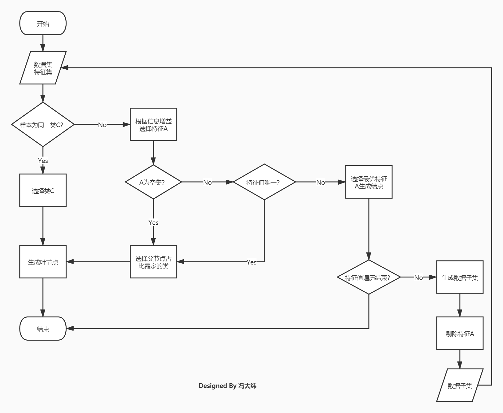

# 决策树实验报告

<p align="right"> 18340040 冯大纬

## 决策树原理

​	决策树是机器学习中一种基本的分类和回归算法，是依托于策略抉择而建立起来的树。其主要优点是模型具有可读性，分类速度快，易于理解。

​	决策树简单来说就是带有判决规则的一种树，可以依据树中的判决规则来预测未知样本的类别和值。

​	决策树是一个属性结构的预测模型，代表对象属性和对象值之间的一种映射关系。它由节点（node）和有向边（directed edge）组成，其节点有两种类型：内节点和叶节点，内部节点表示一个特征或属性，叶节点表示一个类。

​	比如说下面这个决策树

​	

​	当有一组数据**[不拥有房产，未婚，年收入40k]**进入时，依据这个决策树我们可以进行以下决策：

​	进入**拥有房产**节点

​		----->选择**否**分支

​			----->进入**已婚**节点

​				----->选择**否**分支

​					----->进入**年收入**节点

​						----->选择**<80**分支

​							----->做出决策：**无法偿还**

​	本次实验需要实现的决策树类型有ID3、C4.5、CART

## 伪代码与流程图

```c
算法GenerateDecisionTree(samples,attributes)。由给定的数据生成一颗决策树

输入：训练样本samples，由离散值属性表示；候选属性的集合attributes。

输出：一颗决策树

GenerateDecisionTree(samples,attributes):
	创建节点Node
	if samples 属于同一类别 C
    then 
        标记Node为类别C
        return Node
	else if attributes 为空集 or samples所有样本在attributes上取值相同
    then
        标记Node为samples中出现最多的类别
        return Node
	else if samples 为空集
    then
        标记Node为父节点中出现最多的类别
        return Node
	else:
		选择attributes中具有最高信息增益的属性best_attribute
		标记结点 N 为best_attribute
		for each best_attribute 中的未知值A_i
			由结点 N 长出一个条件为 best_attribute = A_i 的分枝
			设S_i 是samples 中best_attribute = A_i 的样本的集合
			if S_i 为空 
			then
				加上一个树叶，标记为 samples 中最普通的类
			else
				加上一个由 Generate_decision_tree(si,attribute_list–best_attribute)返回的结点Node
```

<p align="middle"> 建树伪代码



<p align="middle"> 建树流程图

## 代码结构


<p align="middle"> 代码结构图

代码分为5个类，一个抽象基类`BaseDecisionTree`，`BaseDecisionTree`中包含一个节点类`DecisionNode`，在`BaseDecisionTree`中完成建立决策树的的流程，留出子类可以重写的评估函数和分支选择函数，用反射获得子类的这两个函数来完成建树

三个子类`ID3`、`C45`、`CART`，继承父类`BaseDecisionTree`并重写两个虚函数

## 关键代码

### 父类BaseDecisionTree建立决策树的代码

```python
def __make_tree(self, _data):
    test = {}
    for data in _data:
        if data[-1] not in test:
            test.update({data[-1]: 1})
        else:
            test[data[-1]] += 1
    test_s = sorted(test.items(), key=lambda x: (x[1], x[0]), reverse=True)
    # 判断是否只有一个特征
    # 如果只有一个特征，则返回一个叶子节点，值为该特征
    if len(test_s) == 1:
        node = self.DecisionNode(-1)
        node.isLeafNode = True
        node.value = test_s[0][0]
        return node
    value_dict = {}
    for i in range(len(_data[0]) - 1):
        # 通过反射获得子类重写的评估函数
        self.evaluate_function = getattr(self, 'evaluate_function')
        # 对每一种类别进行评估
        value_dict.update({i: self.evaluate_function(_data, i)})
    # 选择效果最好的特征
    value_dict = sorted(value_dict.items(), key=lambda x: (x[1], x[0]), reverse=True)
    key_feature = value_dict[0][0]
    kf_dict = {}
    # 划分子数据集并去掉该特征
    for data in _data:
        if data[key_feature] not in kf_dict:
            kf_dict.update({data.pop(key_feature): [1, [data]]})
        else:
            kf_dict[data[key_feature]][1].append(data)
            kf_dict[data[key_feature]][1][-1].pop(key_feature)
    # 递归建立多叉树
    for k in kf_dict:
        kf_dict[k] = self.__make_tree(kf_dict[k][1])
    # 建立节点，将之前建立的分支并入该节点的子节点
    node = self.DecisionNode(key_feature)
    node.branch = kf_dict
    node.value = test_s[0][0]
    # 返回该节点
    return node
```

### ID3的评估函数

```python
def evaluate_function(self, _data, key):
    d_entropy = self.calculate_entropy([s[-1] for s in _data])
    key_feature = [[s[key], s[-1]] for s in _data]
    feature_dict, feature_list, i = {}, [], 0
    for feature in key_feature:
        if feature[0] in feature_dict:
            feature_dict[feature[0]][0] += 1
            feature_list[feature_dict[feature[0]][1]].append(feature[1])
        else:
            feature_dict.update({feature[0]: [1, i]})
            feature_list.append([feature[1]])
            i += 1
    entropy = 0.0
    total = sum([s[0] for s in feature_dict.values()])
    for key in feature_dict:
        entropy += feature_dict[key][0] / total * self.calculate_entropy(feature_list[feature_dict[key][1]])
    return d_entropy - entropy
```

### C4.5的评估函数

```python
def evaluate_function(self, _data, key):
    d_entropy = self.calculate_entropy([s[-1] for s in _data])
    key_feature = [[s[key], s[-1]] for s in _data]
    feature_dict, feature_list, i = {}, [], 0
    for feature in key_feature:
        if feature[0] in feature_dict:
            feature_dict[feature[0]][0] += 1
            feature_list[feature_dict[feature[0]][1]].append(feature[1])
        else:
            feature_dict.update({feature[0]: [1, i]})
            feature_list.append([feature[1]])
            i += 1
    entropy = 0.0
    total = sum([s[0] for s in feature_dict.values()])
    for key in feature_dict:
        entropy += feature_dict[key][0] / total * self.calculate_entropy(feature_list[feature_dict[key][1]])
    splitInfo = self.calculate_entropy([s[0] for s in key_feature])
    return (d_entropy - entropy) / splitInfo
```

### CART的评估函数

```python
def evaluate_function(self, _data, key):
    key_feature = [[s[key], s[-1]] for s in _data]
    feature_dict = {}
    gini_d_k = 0.0
    for feature in key_feature:
        if feature[0] in feature_dict:
            feature_dict[feature[0]][0] += 1
            feature_dict[feature[0]][1].append(feature[-1])
        else:
            feature_dict.update({feature[0]: [1, [feature[-1]]]})
    for feature in feature_dict:
        gini = self.branch_function(feature_dict[feature][1])
        gini_d_k += feature_dict[feature][0] / len(key_feature) * gini
    return -gini_d_k
```

## 实验结果分析

- ### 数据集划分

  采用10组交叉验证的方法，先将数据集划分为10个小数据集，第一次用1-9组训练，第10组验证；第二次用2-10组训练，第1组验证......以此类推，总共进行10组训练和验证，取平均准确率作为这颗树的最终准确率。

- ### 实验结果

  |      | 最低准确率 | 最高准确率 | 平均准确率 |
  | ---- | ---------- | ---------- | ---------- |
  | ID3  | 0.9591     | 0.9942     | 0.9755     |
  | C4.5 | 0.9532     | 0.9942     | 0.9732     |
  | CART | 0.9591     | 0.9883     | 0.9744     |

- ### 分析

  由于这次的数据集只有1000多个，属于非常小的数据集，所以ID3的平均效果非常好，因为ID3采用信息熵偏好来选取分支，所以每个叶子节点上的样本树很少，在这种小数据集而且数据纯度很高的情况下能够长出一颗决策比较细致的决策树

  而C4.5的结构采用信息增益比的算法来选择分支，在这种分支本来就不多的决策树上表现得效果不是很好

  我认为CART对于这个样本效果还没有ID3好的主要原因是元数据集维度太少，总共只有6个维度用来作决策，而CART的二叉结构对每个节点都只会选择出一个基尼系数的分支作为左节点，其他的都作为右节点，这个方法对于很多高维度的数据集非常有用，因为维度的数量保证了CART的深度，使其能够做出更准确的预测，而这个数据集建出的CART树只有6层深，虽然准确率的下限很高，但上限不高，因为深度太浅了

## 思考题

- **决策树有哪些避免过拟合的方法？**

  产生过拟合有两种情况，分别为样本问题和方法问题

  样本问题指样本里的噪音数据干扰过大，大到模型过分记住了噪音特征，反而忽略了真实的输入输出间的关系

  方法问题指使用的算法对于决策树的生长没有合理的限制和修剪，导致决策树的自由生长有可能每片叶子里只包含单纯的事件数据或非事件数据

  针对样本问题导致的过拟合，可以先数据清洗，进行合理、有效地抽样，用相对能够反映业务逻辑的训练集去产生决策树

  针对方法问题导致的过拟合，可以采用剪枝方法，比如预剪枝或者后剪枝来避免过拟合

- **C4.5相比于ID3的优点是什么，C4.5又可能有什么缺点？**

  C4.5算法流程与ID3相类似，只不过将信息增益改为信息增益比，以解决偏向取值较多的属性的问题。

  缺点有下：

  1. C4.5生成的是多叉树，即一个父节点可以有多个节点。在计算机中二叉树模型会比多叉树运算效率高。如果采用二叉树，可以提高效率。

  2. C4.5由于使用了熵模型，里面有大量的耗时的对数运算

- **如何用决策树来进行特征选择（判断特征的重要性）？**

  ID3决策树使用信息增益来进行特征选择。

  C4.5决策树使用信息增益比来进行特征选择

  CART决策树使用基尼系数来进行特征选择

  