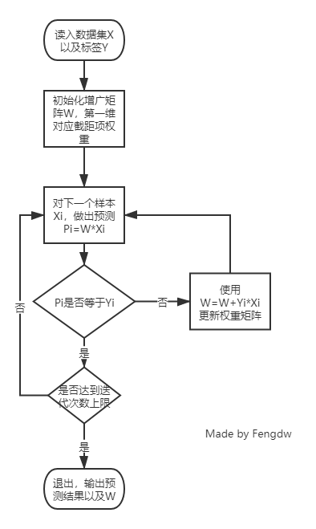
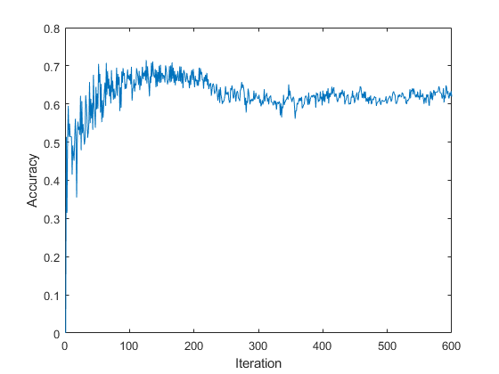
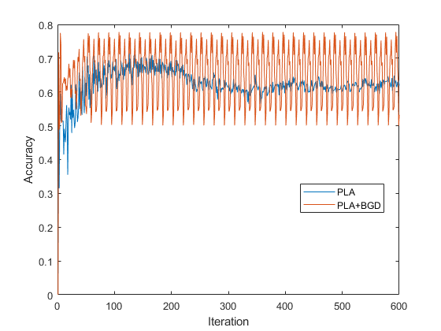
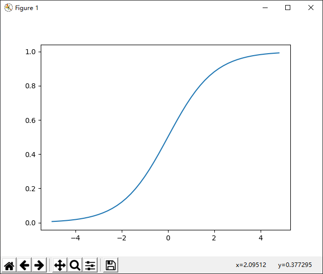
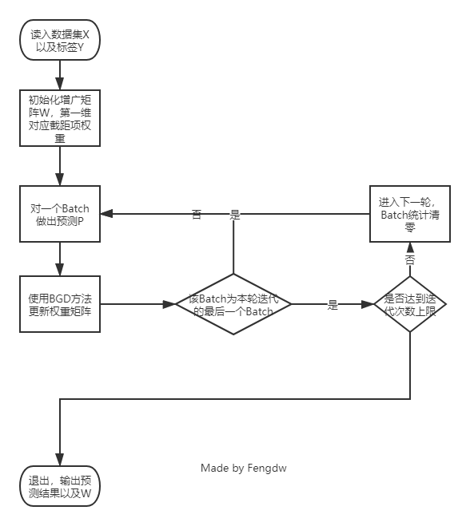
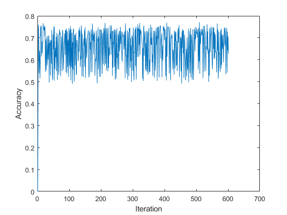

# 感知机与逻辑回归实验报告

<p align="right"> 18340040 冯大纬</p>

## 感知机

### 感知机原理

感知机是二分类的线性分类模型，属于监督学习算法。输入为实例的特征向量，输出为实例的类别（取+1和-1）。感知机旨在求出将输入空间中的实例划分为两类的分离超平面。为求得超平面，感知机导入了基于误分类的损失函数，利用梯度下降法对损失函数进行最优化求解。

如果训练数据集是线性可分的，则感知机一定能求得分离超平面。如果是非线性可分的数据，则无法获得超平面。

感知机可以表示为：$f(x)=sign(w*x+b)$

感知机的几何解释：线性方程$w*x+b$对应于特征空间$R^n$的一个分离超平面；平面将特征空间分为两部分，位于两部分的点分别对应于正、负样本

### 伪代码与流程图

- **流程图**

  

- **伪代码**

  ```
  为w1,w2....wn设置随机值
  输入每一个训练数据
  	输入的训练数据所得到的结果与期望值是否一致
  		一致，进行下一组运算
  	    不一致，按照来进行运算
  	在上一组循环运算中w的值是否发生了改变
  		被改变了，那么再重复一此上述的循环
  		没有改变（所有的值都是期望值）,训练结束
  ```

  

### 关键代码

```python
def train(self):
    """
    感知机训练函数
    :return: None
    """
    t = threading.Thread(target=self.__show_progress)  # 声明一个显示训练进度的线程
    t.setDaemon(True)  # 将显示进度的线程设置为守护线程
    t.start()  # 运行该线程
    for self.it in range(1, self.max_iter + 1):
        self.valid()  # 使用当前W在验证集上验证
        self.__accList.append(self.get_accuracy())  # 获取验证准确率
        self.__argsList.append(self.__w)  # 保存权重W
        predict = self.__run_1_epoch('train')  # 进行一轮预测
        flag = True
        for j in range(len(predict)):
            if predict[j] != self.trainDataLabel[j]:  # 获取一个和预测不符的特征
                flag = False
                self.__optimize(self.trainDataFeature[j], self.trainDataLabel[j])  # 使用该特征更新W
                break
        if flag:  # 如果全部预测正确，结束
            break
    self.__w = self.__argsList[self.__accList.index(max(self.__accList))]  # 获取准确率最高的W作为模型权重
    print('\rTraining Finished', flush=True)
```


### 实验结果

**训练验证集划分：10组交叉验证，准确率取平均值**

使用固定迭代次数，权重初始化为零，每次迭代按顺序从第一个样例开始找下一个错误的样例，共训练100次，最高准确率0.715，绘图如下



### 优化

将原来的每次只使用一个错误样本来更新W改为按batch更新，得到的最高准确率和普通的方法对比如下

|         | 最高准确率 |
| ------- | ---------- |
| PLA     | 0.715      |
| PLA+BGD | 0.7775     |

迭代600轮绘制出图像如下



可见，使用了BGD以后可以明显地看出准确率以0.65附近为基准不断振荡，幅度越来越大，大约60次迭代以后幅度稳定，在最高点可以获得比普通PLA更好的准确率

### 十组交叉验证准确率

两种方法分别在十组训练/验证集上取得了如下效果

|         | 准确率                                                       | 平均准确率 |
| ------- | ------------------------------------------------------------ | ---------- |
| PLA     | [0.7075, 0.725, 0.7475, 0.73875, 0.7425, 0.735, 0.71875, 0.7375, 0.755, 0.74625] | 0.735      |
| PLA+BGD | [0.77625, 0.7725, 0.77875, 0.77, 0.765, 0.7675, 0.76125, 0.765, 0.79, 0.77375] | 0.772      |

**由此，有理由相信使用BGD方法以后的PLA算法可以得到更优的结果**

## 逻辑回归

### 逻辑回归原理

逻辑回归通常针对二分类问题，输入是样本的特征向量$x\in R^n$，输出是样本属于某个类别$y\in {0,1}$的概率

使用sigmoid将预测结果映射到(0,1)的区间，作为标签为1的概率

sigmoid函数
$$
F(x)=\frac{1}{1+e^{-Wx}}
$$


$F(+\infty)=1$ 当加权求和结果无穷大，样本属于正类别的概率为1

$F(-\infty)=0$ 当加权求和结果无穷小，样本属于正类别的概率为0

### 伪代码与流程图

- 流程图

  

- 伪代码

  ```
  构造sigmoid函数
  重复循环I次
  	计算数据集梯度
  	更新线性函数参数
  确定最终的sigmoid函数
  输入训练（测试）数据集
  运用最终sigmoid函数求解分类
  ```

  

### 关键代码

```python
def train(self):
    """
    Logistic训练
    :return: None
    """
    t = threading.Thread(target=self.__show_progress)  # 声明一个显示训练进度的线程
    t.setDaemon(True)  # 将显示进度的线程设置为守护线程
    t.start()  # 运行该线程
    for self.it in range(1, self.max_iter + 1):
        self.valid()  # 使用当前W在验证集上验证
        self.__accList.append(self.get_accuracy())  # 获取验证准确率
        self.__argsList.append(self.__w)  # 保存权重W
        if self.__mode == 'BGD':  # BGD模式
            for j in range(len(self.trainDataLabel)):
                self.__optimize(self.trainDataFeature[j], self.trainDataLabel[j])  # 更新权重
        elif self.__mode == 'SGD':  # SGD模式
            j = random.randint(0, len(self.trainDataLabel))  # 随机选择一个样本
            self.__optimize(self.trainDataFeature[j], self.trainDataLabel[j])  # 更新权重
    self.__w = self.__argsList[self.__accList.index(max(self.__accList))]  # 获取准确率最高的W作为模型权重
    print('\rTraining Finished', flush=True)
```


### 实验结果

**训练验证集划分：10组交叉验证，准确率取平均值**

使用固定迭代次数，权重初始化为零，使用批梯度下降优化，共训练100次，最高准确率0.715，绘图如下



### 优化

由于逻辑回归需要运算$e^x$，BGD迭代的运算速度很慢，迭代600次花费时间46.9989866s，所以尝试SGD迭代，效果对比如下

|              | 最高准确率 |
| ------------ | ---------- |
| Logistic+BGD | 0.77125    |
| Logistic+SGD | 0.77375    |

### 十组交叉验证准确率

两种方法分别在十组训练/验证集上取得了如下效果

|              | 准确率                                                       | 平均准确率 | 平均时间 |
| ------------ | ------------------------------------------------------------ | ---------- | -------- |
| Logistic+BGD | [0.72125, 0.73125, 0.71875, 0.7175, 0.7275, 0.73875, 0.71875, 0.7125, 0.71125, 0.74375] | 0.724125   | 0.0724 s |
| Logistic+SGD | [0.77, 0.775, 0.76, 0.735, 0.74375, 0.765, 0.74875, 0.74125, 0.77125, 0.73125] | 0.754125   | 0.0033 s |

**SGD虽然有可能无法到达全局最优解，但速度非常快，所以我认为在实际训练中使用SGD迭代效果会更好**

## 思考题

1. **不同的学习率$\eta$对模型收敛有何影响？从收敛速度和是否收敛两方面来回答。**

   答：如果学习率过小，收敛速度会非常慢，但可以保证到达局部最优解；如果学习率过大，收敛速度会很快，但有可能无法收敛，最后在局部最优解附近振荡。

2. **使用梯度的模长是否为零作为梯度下降的收敛终止条件是否合适，为什么？一般如何判断模型收敛？**

   答：使用梯度的模长大小是否趋近于零 作为梯度下降的收敛终止条件并不合适 。 梯度趋于零可能是落入到了局部最优解，或鞍点，或大面积的平坦区域。它有可能并没有收敛到最优点。对于逻辑回归，因为它是凹的所以不存在局部最优和鞍点。一般当迭代了一定次数且损失函数长期处于一个固定值时，可以认为模型收敛了。