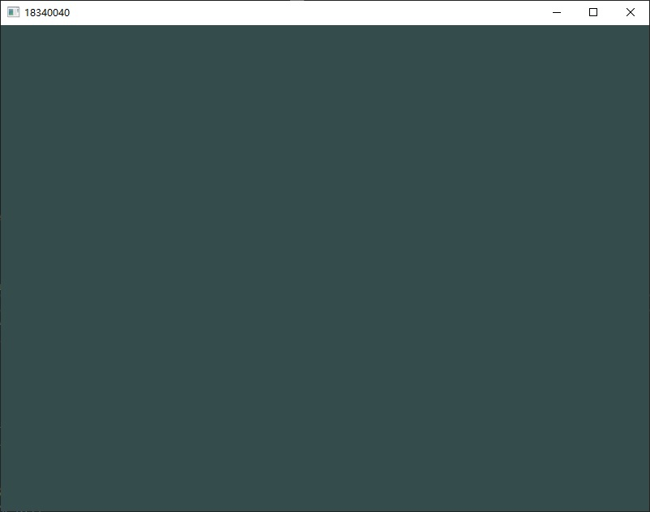
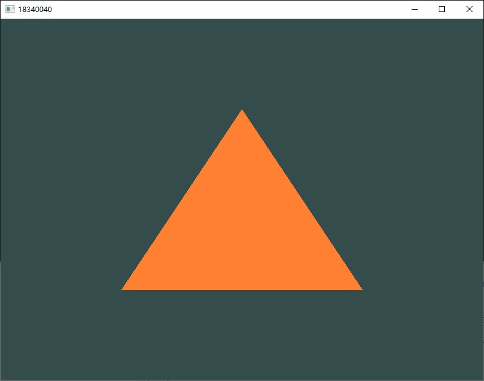
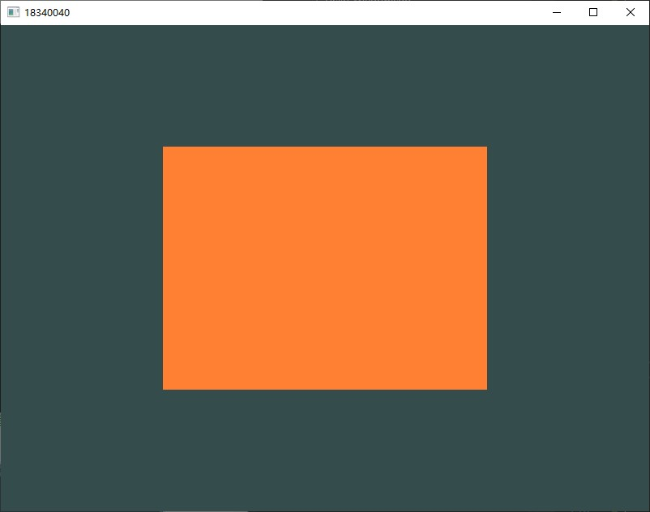
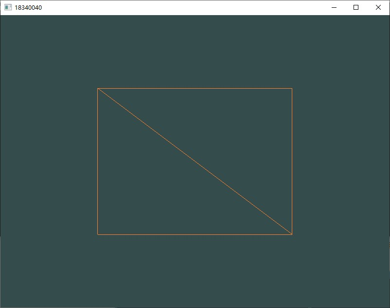
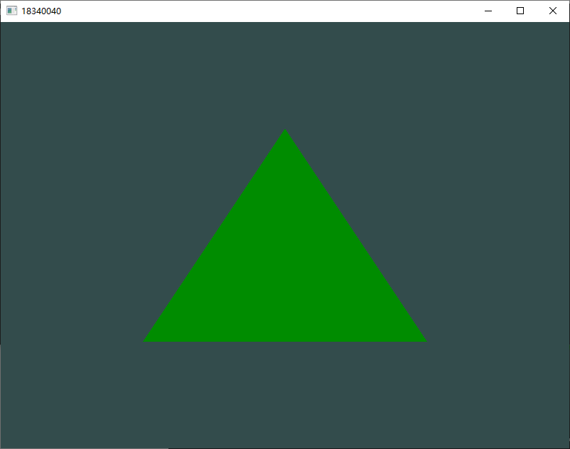
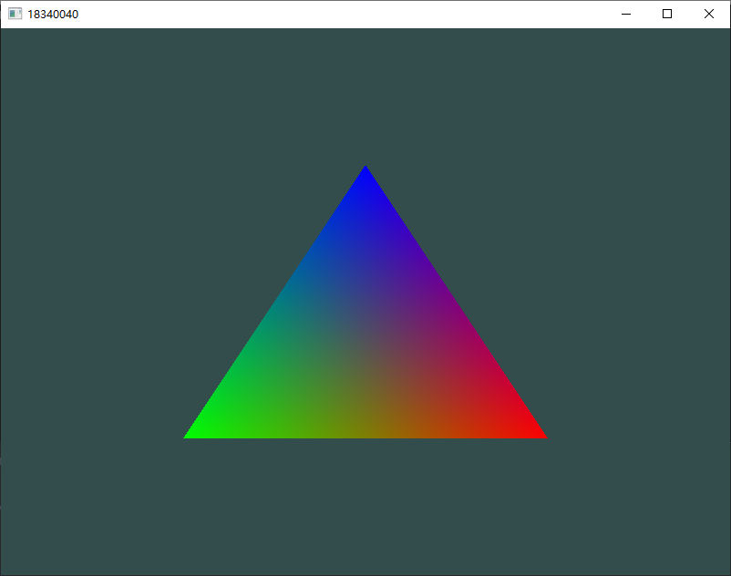
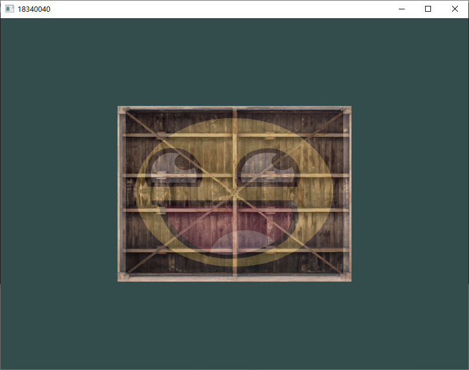
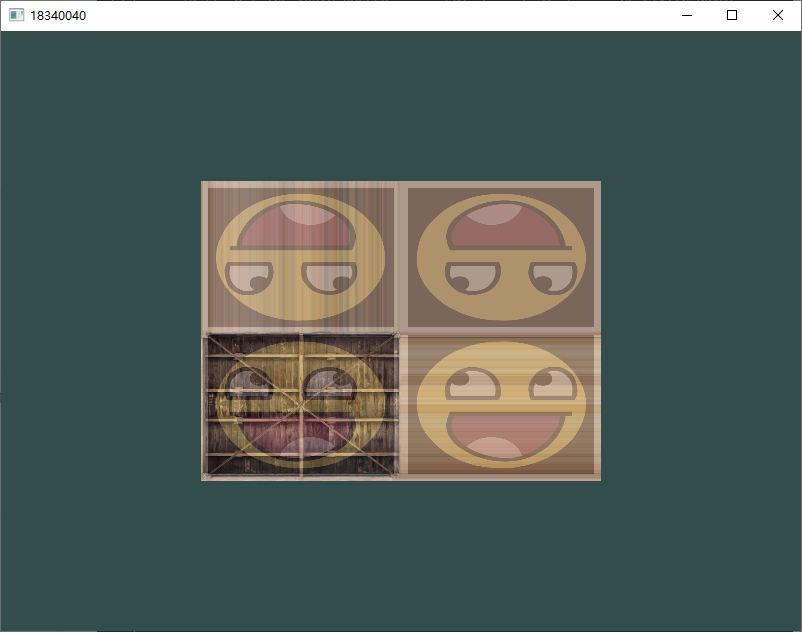

# Assignment 0: Introduction to OpenGL

 18340040 冯大纬

## 实验要求

1. 什么是OpenGL？OpenGL与计算机图形学的关系是什么？
2. 请将在教程你好，窗口、你好，三角形、着色器的实现结果贴出来，要求将实现的窗口的标题改成自己的学号，如下图3所示。
3. 学习完成纹理章节之后，尝试用不同的纹理环绕方式，设定一个从 0.0f 到 2.0f 范围内的（而不是原来的 0.0f 到 1.0f ）纹理坐标。试试看能不能在箱子的角落放置4个笑脸。记得一定要试试其它的环绕方式。简述原因并贴上结果。
4. 谈谈学习了这些教程章节的感想

## 实验结果

1. ### 什么是OpenGL？OpenGL与计算机图形学的关系是什么？

   ### 答：

   - 简单来讲，OpenGL可以被看做一个API，它包含了一系列可以操作图形图像的函数。

   - 但OpenGL本身不是一个API，他是一个由Khronos组织制定并维护的规范，在这个规范中，OpenGL严格规定了每个函数该如何执行以及它们的返回值，按照我的理解，这和标准C/C++库是类似的，标准C/C++库也是由委员会制定的一些规范，这些规范规定了一些函数的输入和返回值，但函数的具体实现步骤以及优化都是由编译器厂商自己去做的。同理OpenGL库的开发者通常是显卡的生产商，而且在使用不同操作系统的时候，OpenGL库的行为可能会出现不同的结果，因为它们是由不同的开发者进行维护的。（也就是说可能会遇到一些莫名其妙的BUG）

   - 我个人认为，从计算机图形学到OpenGL其实就是从抽象到具象的一个过程，计算机图形学是一门学科，在这门学科里，我们会学到很多理论上的相关知识，比如透视的关系，图形渲染管线等很多理论上的实现，然后通过OpenGL我们可以将这些理论实现到计算机的应用程序上，让这些理论实实在在地被我们感受到。

     

2. ### 请将在教程你好，窗口、你好，三角形、着色器的实现结果贴出来，要求将实现的窗口的标题改成自己的学号。

   ### 实验截图

   

   
图1  你好，窗口完成截图

   

   
图2  你好，三角形完成截图

   

   
图3  你好，三角形（Part 2）完成截图

   

   
图4  你好，三角形（Part 3）完成截图

   

   
图5  着色器完成截图

   

   
图6  着色器（Part 2）完成截图

   

   
图7  纹理完成截图

   

3. ### 学习完成纹理章节之后，尝试用不同的纹理环绕方式，设定一个从 0.0f 到 2.0f 范围内的（而不是原来的 0.0f 到 1.0f ）纹理坐标。试试看能不能在箱子的角落放置4个笑脸。记得一定要试试其它的环绕方式。简述原因并贴上结果。
   
   ### 实验截图

   
   
   
图8  完成截图

   
   ### 实验过程：
   
   ​	首先，在纹理映射中，纹理坐标的范围为 $[0.0,1.0]$。当纹理坐标超出这个值时，OpenGL会根据设置的环绕模式来处理这种情况。所以当我们把原来的 $1.0f$ 改成 $2.0f$ 以后， $[0,1]$ 区域和 $[1,2]$ 区域的像素点就会根据设置的环绕方式重新生成。
   
   ​	在设置纹理的环绕方式时，我们可以为每个纹理坐标轴$(S,T,R)$都设置一个环绕模式，$(S,T,R)$对应顶点坐标轴的$(X,Y,Z)$。
   
   ​	为了达到实验要求的效果，我首先让笑脸图案使用在纹理坐标轴的S方向和T方向上都以`GL_MIRRORED_REPEAT`方式环绕，这样就可以获得上下且左右对称的四个笑脸.
   
   ​	对于箱子的纹理环绕，我选择了`GL_CLAMP_TO_EDGE`环绕模式，这个环绕模式会忽略边缘的纹理采样，不把他们包括在平均值中。
   
   ​	最后在窗体循环中每次将两个纹理依次渲染，就得到了实验要求的效果。
   
   
   
4. ### 谈谈学习了这些教程章节的感想

   ​	跟着教程做了几个实验以后，感觉到这门课和别的编程课程的不同点在于可以很直观地看到效果，而不是再面对一个黑色的命令行界面了。能够看到自己的代码在界面中生成一个三角形很有成就感，在学习了着色器以后甚至还能够让三角形随着时间变换颜色。

   ​    感觉纹理部分以后会经常用到，做游戏或者做CG什么的用来贴图应该很方便。

   ​    就是调bug的话比较麻烦，毕竟API的集成度太高了，有的时候结果不对也看不出来到底是哪一部分出了问题，只能对照着他给的代码一点一点查哪里写错了。比如在做那个笑脸覆盖到木箱上的实验的时候，第一次运行时候遇到了笑脸不显示的问题，找了好久也没有找到原因，对着文档给出的代码一行一行DEBUG的时候才发现原来是把一个Userprogram写成了着色器导致的。改了以后又发现笑脸的颜色非常奇怪，又接着DEBUG，看了评论区发现原来读取PNG文件的时候要使用RGBA参数来读取，改了这个参数以后终于出现了预期的结果，很有成就感。