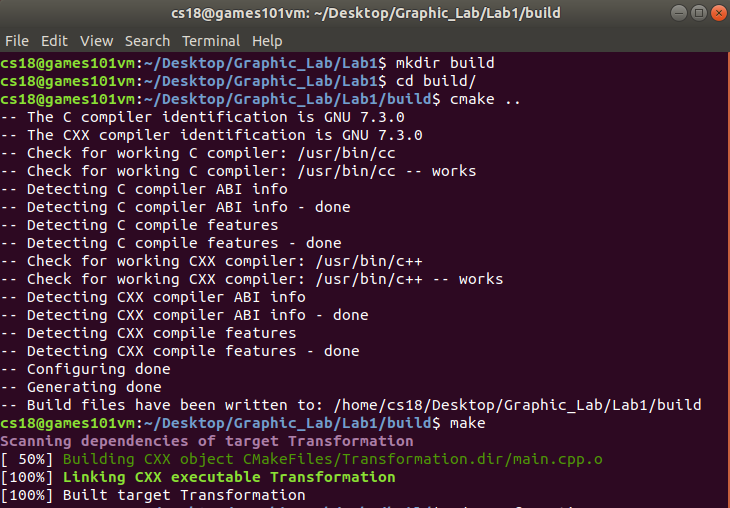
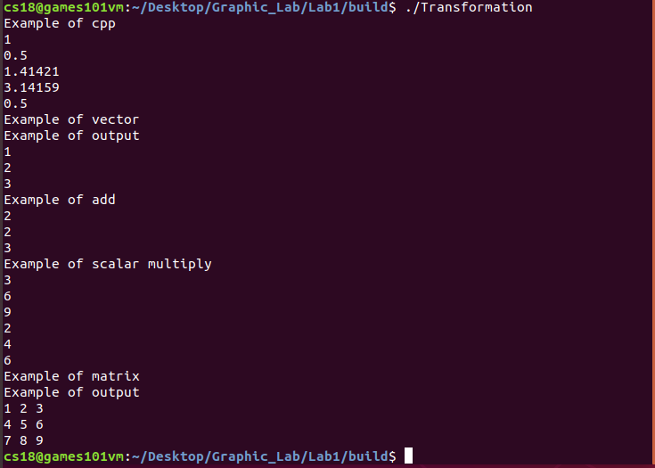
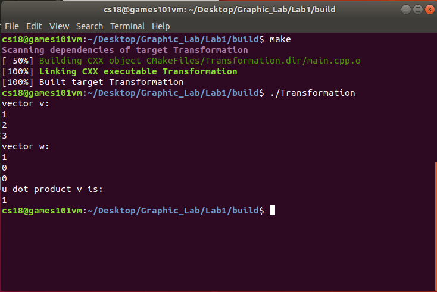
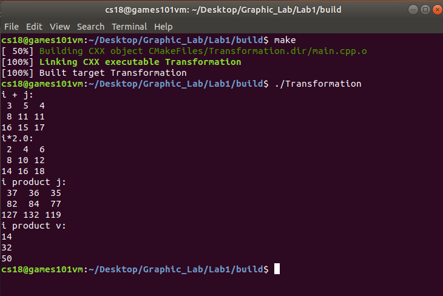

# Assignment 1: 环境搭建与使用

 18340040 冯大纬

## 实验要求

​	为了免去配置作业所需环境的麻烦，本次课程使用虚拟机，学生在虚拟机内编写，编译和运行代
码。我们提供的文件为虚拟硬盘文件，使用虚拟机挂载该文件后，就可以保证所有人的环境是统一并且
完善的，不需要再手动配置环境。在安装完虚拟机后，我们需要手动安装 Guest Additions 来增强虚拟
机的功能。

## 实验结果

1. ### 按照前面的教程搭建好虚拟机，并编译运行框架代码，在报告中贴出程序运行的结果。

   

   
图1  CMAKE编译过程

   

   
图2  Transformation运行结果

2. ### 在框架代码的基础上，了解Eigen库的向量的使用，并在代码中实现v 和w 向量点乘并输出结果，在报告中贴上结果截图。

   **因为原本的代码输出太多，为了避免影响观感，这里把其他的输出先注释掉了，只留下了要求输出的结果。**

   

   
图3  v点乘w运行结果

3. ### 在框架代码的基础上，了解Eigen库的矩阵的使用，并在代码中实现i 与j 的矩阵相加、i 与2.0的数乘、i 与j 的矩阵相乘、i 与v 的矩阵乘向量，并输出相应的结果，在报告中贴上结果截图。

   **同样为了避免冗余输出过多，将不必要的输出先全部注释掉了**

   

   
图4  job2运行结果

## 实验过程

   跟着pdf的教程和Eigen的文档一步步走就完成了

## 谈谈学习了这些教程章节的感想

​	感觉Assignment1比Assignment0要简单好多，可能是TA把大部分工作都做掉了吧，只给我们留了为数不多的代码需要编写(笑)，而且代码也都很简单，矩阵的运算符Eigen库都有重载，写起来有一种在调用numpy包写Python的感觉，总而言之就是写起来很舒服。

​	话说清华镜像属实8太行，校园网下个文件断线四次才下载下来，建议以后改用蓝奏云。

​	感觉其实如果用VS把环境搭好的话好像更方便，而且VS环境配置起来也不难，就把Eigen的头文件放到项目的include文件夹里然后在解决方案的属性里把包含路径设置一下就行了，经过我一番尝试也成功运行了。

​	话说又回到看不到三角形的命令行界面了，不知道什么时候才能再见到和蔼的三角形。