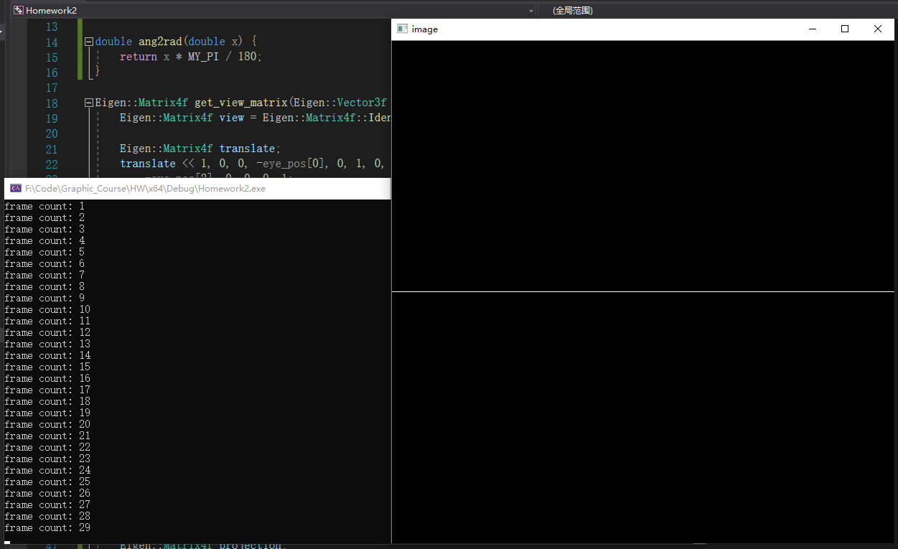
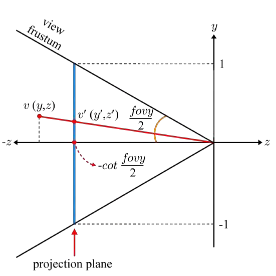
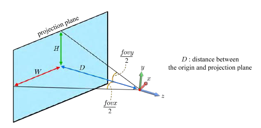
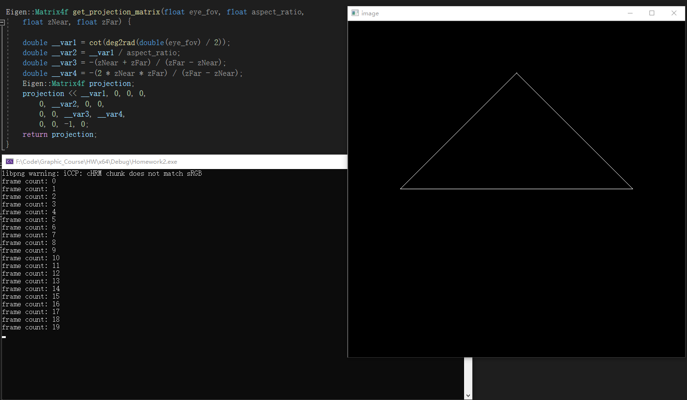
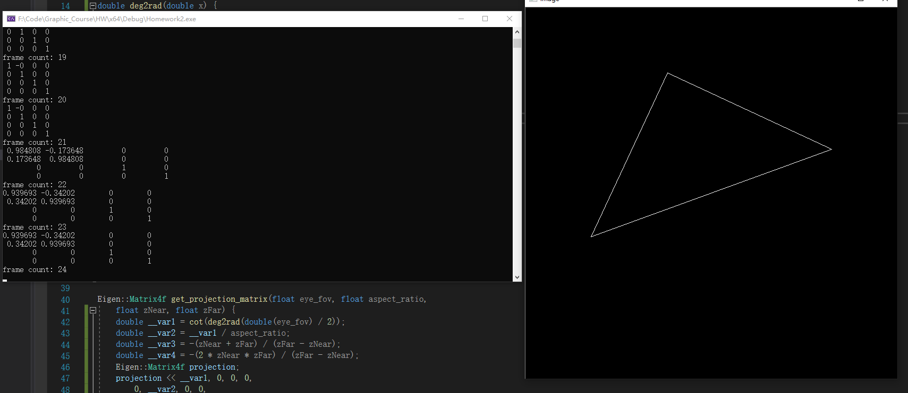
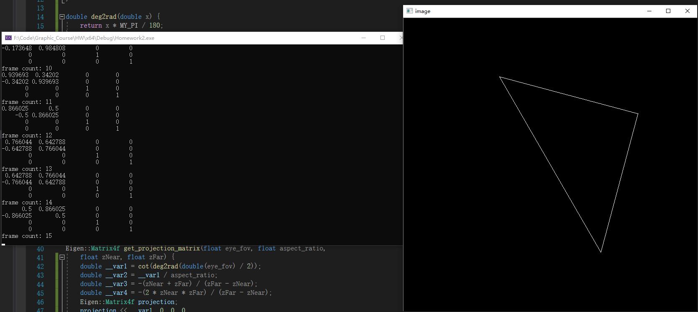

# Assignment 2: 变换与投影

## 实验要求

- **Job1、编译我们提供的代码并运行，将运行的结果截图。**
- **Job2、构建透视投影矩阵，将编译运行结果截图，并简述一下矩阵是如何构建。**
- **Job3、构建旋转变换矩阵，截图三张旋转结果，并简述一下矩阵是如何构建的。**
- **Job4、谈谈你对四维齐次坐标的理解。**

## 实验结果

### 实验环境

构建工具：VS2019

OS：Windows10 Ver.1903

### Job1、编译我们提供的代码并运行，将运行的结果截图。



<p align="middle"> 图1 不加任何修改的代码运行结果
</p>

### Job2、构建透视投影矩阵，将编译运行结果截图，并简述一下矩阵是如何构建。

#### 推导过程

矩阵推导过程参考***3D Graphics for Game Programming***  Chapter 2.4.3  Derivation of Projection Matrix

首先假设一个点$v (x,y,z)$被投影到$v' (x',y',z')$

变换后$x',y'\in[-1,1],z'\in[-1,0]$

首先推导$y$的变换过程，$y$映射到$y'$的过程可以由下图表示



<p align="middle"> 图2-1 y变换到y'

</p>

由图2-1易推导出$y'$的表达式如下：
$$
\because y:z=y':-cot\frac{fovy}{2}\\
\therefore y'=-cot\frac{fovy}{2}\times \frac{y}{z}
$$
接下来推导$x$到$x'$的变换过程，fov和aspect之间的几何关系可以表示为下图




<p align="middle"> 图2-2 fov和aspect间的几何关系</p>

由图2-2，我们可以得出aspect和fov间的数学关系
$$
\because \frac{W}{H}=tan\frac{fovx}{2}\\
\therefore W=D\times tan\frac{fovx}{2}\\
同理\ H=D\times tan\frac{fovy}{2}\\
\therefore aspect=\frac{W}{H}=\frac{tan\frac{fovx}{2}}{tan\frac{fovy}{2}}=\frac{cot\frac{fovy}{2}}{cot\frac{fovx}{2}}
$$
将其变换为我们需要的形式，即
$$
cot\frac{fovx}{2}=\frac{cot\frac{fovy}{2}}{aspect}
$$
由此，我们可以得出$x'$的表达式，即
$$
x'=-cot\frac{fovx}{2}\times \frac{x}{z}=-\frac{cot\frac{fovy}{2}}{aspect}\times \frac{x}{z}
$$
对于已知变量，我们假设$cot\frac{fovy}{2}=D,aspect=A,zNear=n,zFar=f$，那么由$(1)(4)$式，我们可以得出一部分$v'$的坐标表达式
$$
v'=(x',y',z',1)\\
=(-\frac{cot\frac{fovy}{2}}{aspect}\times \frac{x}{z},-cot\frac{fovy}{2}\times \frac{y}{z},z',1)\\
=(-\frac{D}{A}\times \frac{x}{z},-D\times \frac{y}{z},z',1)\\
=(\frac{D}{A} x,D y,-z'z,-z)
$$

由$(5)$式，我们可以写出如下的变换过程

$$
\left( \begin{matrix} \frac{D}{A} x\\ D y \\ -z'z \\ -z \end{matrix} \right)
=\left( \begin{matrix} \frac{D}{A} & 0 & 0 & 0\\ 0 & D & 0 & 0 \\ m_1 & m_2 & m_3 & m_4\\ 0 & 0 & -1 & 0 \end{matrix} \right)
\left( \begin{matrix} x\\ y \\ z \\ 1 \end{matrix} \right)
$$

在$(6)$式中，我们已经完成了$4\times 4$矩阵的第1，2，4行，对于第三行，我们可以写出这一行的运算过程，即
$$
-z'z=m_1x+m_2y+m_3z+m_4
$$
由于最后的结果很明显和$x,y$无关，所以$m_1=0,m_2=0$，$(7)$式可以化简为
$$
-z'z=m_3z+m_4\\
即z'=-m_3-\frac{m_4}{z}
$$
根据变换关系，我们可以很自然的想到两个特殊的$z$值，分别是$-f$和$-n$，这两个值分别被映射到$-1$和$0$上，将其代入$(8)$式得如下方程组
$$
-1=-m_3+\frac{m_4}{f}\\
0=-m_3+\frac{m_4}{n}
$$
解这个方程组，可以得到$m_3,m_4$的值为
$$
m_3=\frac{f}{f-n}\\
m_4=\frac{n-f}{f-n}
$$
综合$(6)(10)$式，我们推导出了最后的变换矩阵
$$
\left( \begin{matrix} \frac{D}{A} & 0 & 0 & 0\\ 0 & D & 0 & 0 \\ 0 & 0 & \frac{f}{f-n} & \frac{n-f}{f-n}\\ 0 & 0 & -1 & 0 \end{matrix} \right)
$$


#### 关键代码

```c++
Eigen::Matrix4f get_projection_matrix(float eye_fov, float aspect_ratio,
    float zNear, float zFar) {
    double __var1 = cot(deg2rad(double(eye_fov) / 2));
    double __var2 = __var1 / aspect_ratio;
    double __var3 = -(zNear + zFar) / (zFar - zNear);
    double __var4 = -(2 * zNear * zFar) / (zFar - zNear);
    Eigen::Matrix4f projection;
    //根据(12)式填充project矩阵
    projection << __var1, 0, 0, 0,
        0, __var2, 0, 0,
        0, 0, __var3, __var4,
        0, 0, -1, 0;
    return projection;
}
```

#### 运行截图



<p align="middle"> 图2-3 运行时截图

</p>

### Job3、构建旋转变换矩阵，截图三张旋转结果，并简述一下矩阵是如何构建的。

#### 推导过程

假设一个点$p(x,y,z)$绕Z轴旋转以后变换到了$p'(x',y',z')$

由于绕Z轴旋转后$p$点的z坐标是不变的，所以可知$z'=z$

想象一个水平面内的点旋转$\theta$度，很容易写出旋转后的$x',y'$坐标
$$
x'=xcos\theta-ysin\theta\\
y'=xsin\theta+ycos\theta
$$
由此构建$4\times 4$旋转矩阵
$$
\left( \begin{matrix} cos\theta & -sin\theta & 0 & 0\\ sin\theta & cos\theta & 0 & 0 \\ 0 & 0 & 1 & 0\\ 0 & 0 & 0 & 1 \end{matrix} \right)
$$

#### 关键代码

```c++
Eigen::Matrix4f get_model_matrix(float rotation_angle) {
    Eigen::Matrix4f model;
    model << cos(deg2rad(rotation_angle)), -sin(deg2rad(rotation_angle)), 0, 0,
        sin(deg2rad(rotation_angle)), cos(deg2rad(rotation_angle)), 0, 0,
        0, 0, 1, 0,
        0, 0, 0, 1;
    //std::cout << model << std::endl;
    return model;
}
```

#### 运行截图



<p align="middle"> 图3-1 按A旋转</p>



<p align="middle"> 图3-2 按D旋转</p>

### Job4、谈谈你对四维齐次坐标的理解。

四维其次坐标就是将三维空间中的坐标$(x,y,z)$写成$(x,y,z,w)$的形式

当w=1时，表示一个点，当w=0时，表示一个向量

假设在三维空间中有一个坐标$(x,y,z)$，此时我们并不知道这个坐标表示一个点还是一个向量

当一个平移变换矩阵对这个坐标做变换时，无论其表示的是一个向量还是一个点，都会被变换，这显然不符合我们的需求，因为一个向量无论怎么平移也不应该改变方向，此时四维齐次坐标的优势就显现出来了

考虑这样一个平移变换矩阵
$$
\left( \begin{matrix} 1 & 0 & 0 & dx\\ 0 & 1 & 0 & dy \\ 0 & 0 & 1 & dz\\ 0 & 0 & 0 & 1 \end{matrix} \right)
$$
当其作用于一个点$(x,y,z,1)$时
$$
\left( \begin{matrix} 1 & 0 & 0 & dx\\ 0 & 1 & 0 & dy \\ 0 & 0 & 1 & dz\\ 0 & 0 & 0 & 1 \end{matrix} \right)
\left( \begin{matrix} x\\ y \\ z\\ 1 \end{matrix} \right)
=
\left( \begin{matrix} x+dx\\ y+dy \\ z+dz \\ 1 \end{matrix} \right)
$$
当其作用于一个向量$(x,y,z,0)$时
$$
\left( \begin{matrix} 1 & 0 & 0 & dx\\ 0 & 1 & 0 & dy \\ 0 & 0 & 1 & dz\\ 0 & 0 & 0 & 1 \end{matrix} \right)
\left( \begin{matrix} x\\ y \\ z\\ 0 \end{matrix} \right)
=
\left( \begin{matrix} x\\ y \\ z \\ 0 \end{matrix} \right)
$$
可见，点被平移了，但向量没有，符合了我们的需求


## 谈谈学习了这些教程章节的感想

这次作业比较难的部分在理论方面，主要就是要推导那个透视矩阵和旋转矩阵，旋转矩阵相比起来还好推导一些，但透视矩阵花的功夫就比较多了，首先还是要理解图形学中世界空间和观察空间以及屏幕空间之间的关系，只有完全搞明白了这三个东西，才能够推导出透视矩阵的最后形式。