## 概述和物理层

1. 下面图中从主机A到主机B有多少经过多少个直连网？

   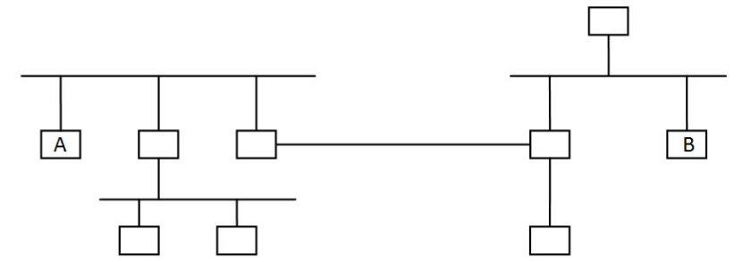

   A. 3  

   B. 4 

   C. 5 

   D. 6

   <table><tr><td bgcolor=black>A</td></tr></table>

2. 无线电台使用了哪种多路复用技术?

   A. Time Division Multiplexing 

   B. Frequency Division Multiplexing 

   C. Statistic Multiplexing 

   D. Code Division Multiplexing

   <table><tr><td bgcolor=black>B</td></tr></table>

3. 哪种网络一般采用多路访问链路？

   A. SAN 

   B. LAN 

   C. MAN 

   D. WAN

   <table><tr><td bgcolor=black>B</td></tr></table>

4. 多播的通信方式是指什么?

   A.一对一 

   B.一对多 

   C.一对所有

   D.多对一

   <table><tr><td bgcolor=black>B</td></tr></table>

5. 每个时刻一个站点发送一个站点接收的通信方式是指什么? 

   A.multicast 

   B.unicast 

   C.broadcast

   D.anycast

   <table><tr><td bgcolor=black>B</td></tr></table>

6. 把许多网络连成的网络称为什么? 

   A.internetwork 

   B.the Internet

   <table><tr><td bgcolor=black>A</td></tr></table>

7. 通常使用以下哪种设备连接多个网络来形成更大的网络?

   A.host 

   B.cellphone 

   C.router 

   D.repeater

   <table><tr><td bgcolor=black>C</td></tr></table>

8. 电话使用了以下哪种传输方式? 

   A.full-duplex 

   B.half-duplex 

   C.simplex 

   D.none

   <table><tr><td bgcolor=black>A</td></tr></table>

9. 实验室一般采用以下哪种连网方式? 

   A.SAN 

   B.LAN 

   C.MAN 

   D.WAN

   <table><tr><td bgcolor=black>B</td></tr></table>

10. 因特网属于以下哪种网络? 

    A.SAN 

    B.LAN 

    C.MAN 

    D.WAN

    <table><tr><td bgcolor=black>D</td></tr></table>

11. 下面的电信模式分别使用了什么服务类型? （填可选项的字母） 

     普通邮件  

     <table><tr><td bgcolor=black>C</td></tr></table>

     电话  

     <table><tr><td bgcolor=black>B</td></tr></table>

     快件   

     <table><tr><td bgcolor=black>A</td></tr></table>

     可选项：A.无连接有确认服务;B.面向连接的服务;C.尽力服务(无连接无确认)

12. 手机属于因特网的哪个部分?

     A.end systems 

     B.communication links 

     C.routers

     <table><tr><td bgcolor=black>A</td></tr></table>

13. WiFi属于以下哪个部分? 

     A.network core 

     B.access network

     C.network edge

     <table><tr><td bgcolor=black>B</td></tr></table>

     <table><tr><td bgcolor=black>network core -- 主干网
     access network -- 接入网
     network edge -- 网络边界(主机及网络程序)</td></tr></table>

14. 如果有8个速率相同的数据流，且它们速率之和小于且接近一条链路的带宽，与用8个通道(channel)的TDM或FDM传送它们相比，采用统计多路复用技术的带宽利用率(传送有效数据的比率)怎么样？ 

     A.更好 

     B.更差 

     C.一样 

     D.不一定

     <table><tr><td bgcolor=black>B</td></tr></table>

     <table><tr><td bgcolor=black>都可以用完整个带宽，只是统计复用技术需要地址，因此会差一点</td></tr></table>

15. 一般网络体系结构(OSI参考模型)和TCP/IP体系结构分别把网络协议分为几层？

     <table><tr><td bgcolor=black>OSI-7,TCP/IP-4或5</td></tr></table>

     <table><tr><td bgcolor=black>OSI参考模型中的七层协议的会话层和表达层在TCP/IP体系结构都放在应用层，如果再把链路层和物理层放在物理网络层，加上网络层和传输层，TCP/IP体系结构就是四层。如果链路层和物理层分开看就是五层。最低两层可以合并起来看是因为TCP/IP协议并不定义链路层和物理层的协议。</td></tr></table>

16. 结点到结点(node-to-node)或跳到跳(hop-by-hop)、主机到主机(host-to-host)和端到端(end-to-end)的传输分别由哪层完成？

     <table><tr><td bgcolor=black>数据链路层，网络层，传输层</td></tr></table>

17. 数据链路层负责什么工作? 

     A.routing 

     B.transfering bit stream on a wire 

     C.transfering packets in a physical network 

     D.transfering data between processes

     <table><tr><td bgcolor=black>C</td></tr></table>

18. 加密解密是OSI参考模型的哪一层的功能?

     A.Network 

     B.Presentation 

     C.Transport 

     D.Session

     <table><tr><td bgcolor=black>B</td></tr></table>

19. FTP协议属于OSI参考模型的哪一层? 

     A.Transport 

     B.Application 

     C.Presentation 

     D.Network

     <table><tr><td bgcolor=black>B</td></tr></table>

20. 因特网的传输层、网络层、数据链路层的数据包的专用名称分别是什么？(填可选项的字母)      

     可选项: 

     A.frame 

     B.segment 

     C.bit 

     D.datagram

     <table><tr><td bgcolor=black>BDA</td></tr></table>

21. OSI模型的哪一层负责多个数据流同步? 

     A.Network 

     B.Transport 

     C.Session

     D.Presentation

     <table><tr><td bgcolor=black>C</td></tr></table>

22. 一条链路的带宽(bandwidth)一定大于等于其吞吐量(throughput)，这句话是否正确？ 

     A.正确 

     B.错误

     <table><tr><td bgcolor=black>A</td></tr></table>

23. 某一层的协议从上层协议收到`______`,用`______`进行封装为`______`后，把它发送给。 

      可选项：SAP，PDU，Peer Entity，SDU，PCI

      <table><tr><td bgcolor=black>SDU、PCI、PDU</td></tr></table>

24. 因特网的三个组成部分为end system,`______`和`______`.

     <table><tr><td bgcolor=black>communication links,routers</td></tr></table>

25. 一条点到点链路长200公里，传播速度为2×10^8米/秒。如果发送一个100字节的包，以多少带宽(bps)它的传播延迟(propagation delay)会等于其传输延迟(transmit delay)?（只写最后结果，单位为Kbps）

     <table><tr><td bgcolor=black>800</td></tr></table>

     <table><tr><td bgcolor=black>8 * 100 / X（bps） = 200*1000/（2×10^8）= 1 / 1000 
     X = 800000bps = 800Kbps</td></tr></table>

26. 一条点到点链路长200公里，传播速度为2×10^8米/秒，带宽为100Mbps。发送一个20000比特的包通过该链路需要多长时间(ms)? 考虑从第一位发送到收到最后一位的时间。（只填最后结果的数值，单位为ms）

     <table><tr><td bgcolor=black>1.2</td></tr></table>

     <table><tr><td bgcolor=black>200000/200000000+20000/100000000=1ms+0.2ms = 1.2ms</td></tr></table>

27. 如果一个长度为3000字节的文件用一个数据包从源主机通过一段链路传给了一个交换机（采用store-and-forward方式),然后再通过第二段链路到达目的主机。如果在包交换机的延迟为2ms, 两条链路上的传播延迟都是2×10^8米/秒,带宽都是1Mbps, 长度都是6,000公里。问这个文件在这两台主机之间的总延迟是多少？

     <table><tr><td bgcolor=black>110ms</td></tr></table>

     <table><tr><td bgcolor=black>(3000*8/1000000 s + 6000000/2*10^8 s)* 2  + 2ms
     = (24ms+30ms)*2+2ms = 110 ms</td></tr></table>

28. 如果把上面题目中的文件分成10个数据包。问传送这个文件的整个延迟是多少? 

     <table><tr><td bgcolor=black>88.4ms</td></tr></table>

     <table><tr><td bgcolor=black>第一个包的整个延迟+剩余包的接收延迟（或发送延迟） 
        *-----+-----&      +  2ms 
       *-----+-----&       *  发送延迟 
      *-----+-----&        &  接收延迟 
     *-----+-----&         -  传播延迟 
     300*8/1000000 * 2 s + 2ms + 6000000/2*10^8*2 s + 9 * 300*8/1000000 s = 11*2.4ms + 2ms+ 60ms = 88.4ms 
     </td></tr></table>

29. 如果在上面题目中，只采用一个包发送整个文件，并且包交换机不采用存储转发技术(收到整个包才转发)而采用收到一位立即转发一位。问传送这个文件的整个延迟是多少?

     <table><tr><td bgcolor=black>84ms</td></tr></table>

     <table><tr><td bgcolor=black>整个文件的发送延迟+传播延迟+1位转发延迟（忽略） 
     3000*8/1000000 s + 6000000/2*10^8 s * 2 
     = 24ms+30ms*2 = 84ms 
     </td></tr></table>

30. 什么是模拟信号？

     A.signal with continuous information 

     B.signal with digital information 

     C.discrete signal 

     D.signal with continuous waveform.

     <table><tr><td bgcolor=black>A</td></tr></table>

31. 下面哪种编码同时调制了相位和振幅？

     A.ASK 

     B.PSK 

     C.QAM 

     D.FSK

     <table><tr><td bgcolor=black>C</td></tr></table>

32. 时钟漂移主要是因为什么原因引起的？（多选）

     A.发送方和接收方使用了相同的时钟信号 

     B.发送时短时间就会出现校正信号 

     C.发送方和接收方使用了不同的时钟信号 

     D.发送时长时间没有包含校正信号

     <table><tr><td bgcolor=black>CD</td></tr></table>

33. 基线漂移主要是因为什么原因引起的？

     <table><tr><td bgcolor=black>长时间传输相同电平的信号导致链路上的同种电荷不断累积，最后导致信号整体偏离了基准线。</td></tr></table>

34. 下面哪种编码可以克服时钟漂移和基线漂移？ 

     A.单级编码 

     B.PSK 

     C.不归零反转编码 

     D.曼彻斯特编码

     <table><tr><td bgcolor=black>D</td></tr></table>

35. 利用起始是否跳变区分0和1而且中间必须跳变的编码是哪种？ 

     A.不归零编码 

     B.差分曼彻斯特编码 

     C.不归零反转编码 

     D.曼彻斯特编码

     <table><tr><td bgcolor=black>B</td></tr></table>

36. 如果二进制数据10011001的曼彻斯特编码的数字信号用0110100101101001（1和0分别表示正电压和负电压信号，并持续相同时间长度）表示，问：10001101的曼彻斯特编码的数字信号表示是什么(中间不要加空格和其他符号)？

     <table><tr><td bgcolor=black>0110011001011010</td></tr></table>

37. 如果采用与上题类似的方法表示差分曼彻斯特编码，并且从高电平开始，二进制数据10001101的差分曼彻斯特编码的数字信号表示是什么(中间不要加空格和其他符号)？

     <table><tr><td bgcolor=black>1010101001101001</td></tr></table>

38. 要发送的数据采用4B/5B编码最多会出现多少个连续0？ 二进制数据1010100110001100的4B/5B编码是什么(中间不要加空格和其他符号)？

     <table><tr><td bgcolor=black>3，10110100111001011010</td></tr></table>

39. 网络传输主要会使用哪些有线物理介质?

     <table><tr><td bgcolor=black>双绞线, 同轴电缆, 光纤</td></tr></table>

40. 光纤传输利用了光的什么特性？ 

     A.reflection 

     B.refraction 

     C.total reflection 

     D.total refraction

     <table><tr><td bgcolor=black>C</td></tr></table>

41. 下面哪种光纤具有最大的数据传输速率? 

     A.single-mode fiber (单模光纤) 

     B.step-index multimode fiber(阶跃多模光纤) 

     C.graded-index multimode fiber(渐变多模光纤)

     <table><tr><td bgcolor=black>A</td></tr></table>

42. 下面哪种非屏蔽双绞线(unshielded twisted pair, UTP)最适合千兆以太网使用? 

     A.cat3 

     B.cat4 

     C.cat5 

     D.cat6

     <table><tr><td bgcolor=black>D</td></tr></table>

     <table><tr><td bgcolor=black>cat6（六类）UTP就是千兆以太网的标准UTP 
     cat5用于100Mbps以太网 
     cat5e（超5类）可以用于百兆或千兆以太网。 
     </td></tr></table>

43. 电话系统使用了以下哪种交换方式？ 

     A.circuit switching 

     B.packet switching

     <table><tr><td bgcolor=black>A</td></tr></table>

44. 与电路交换技术相比，以下哪些是包交换技术的特性? （多选）

     A. 可以确保数据流带宽 

     B. 可能引起网络拥塞 

     C. 适合发送突发数据 

     D. 有呼叫建立过程

     <table><tr><td bgcolor=black>BC</td></tr></table>

45. 假设用户共享一个2Mbps的链路，并且每个用户在传送数据时都需要200Kbps的带宽，如果使用电路交换，最多几个用户可以共享这个链路? 

     <table><tr><td bgcolor=black>10</td></tr></table>

46. 如果上面问题采用包交换技术，让30个用户共享这个链路，每个用户只有20%的时间在发送数据。问有6个用户同时发送的概率是多少？(Hint: Use the binomial distribution.) 

     <table><tr><td bgcolor=black>约为18%</td></tr></table>

     <table><tr><td bgcolor=black>任何时刻一个用户发送的概率为20%，不发送的概率为80%。30个用户中有6个用户发送的概率为： 
     C(30,6) * 0.2^6 * 0.8^24 
     =593775 * 0.000064 * 0.004722366482869645213696 
     = 0.1794575 
     </td></tr></table>

47. 假定12个包同时到达包交换机的输出接口，此时并没有任何包在此输出接口处发送或排队。如果每个数据包的长度都是300字节，该接口的带宽为1Mbps。这些数据包的平均排队延迟是多少?

     <table><tr><td bgcolor=black>13.2ms</td></tr></table>

     <table><tr><td bgcolor=black>每个包的发送时间为300bytes/1Mbps，即2.4ms。 
     第一个排队时间为0，第二个包的排队时间为1*2.4ms，...，第12包的排队时间为11*2.4ms。因此，平均排队时间为： 
         (0+……+11)*2.4/12 =66*2.4ms/12=13.2ms 
     </td></tr></table>

48. 考虑下图中的电路交换网络。如果每条垂直链路用FDM或TDM分成10个电路，每个水平链路分成20个电路。这个网络最多可以建立多少个并发连接？

     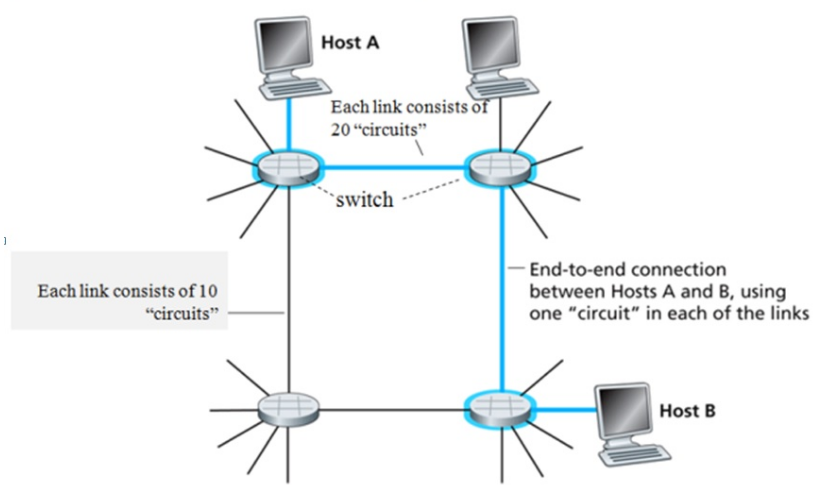

     <table><tr><td bgcolor=black>60</td></tr></table>

     <table><tr><td bgcolor=black>按照上课所讲，这里假设电脑与交换机采用专线，电脑足够多。每条电路可以形成一个连接，共有10+10+20+20=60个电路，因此最多可以形成60个并发连接。</td></tr></table>

49. 在上面问题中,假设所有的连接都是左上角到右下角。这个网络最多可以建立多少个并发连接？

     <table><tr><td bgcolor=black>20</td></tr></table>

     <table><tr><td bgcolor=black>每个连接或者是一条水平线接一条垂直线或者是一条垂直线接一条水平线，最多可以建20个这样的连接。</td></tr></table>

## 数据链路层

1. 数据链路层的功能是负责在`______`中传输数据帧。

   <table><tr><td bgcolor=black>物理网络</td></tr></table>

2. 以下哪些是数据链路层的功能? 

   A.framing 

   B.error detection 

   C.error control 

   D.routing

   E.medium access control 

   F.encryption

   <table><tr><td bgcolor=black>ABCE</td></tr></table>

3. 以下为收到的带有二维奇偶校验码(偶校验)的数据: 

   10001 

   11000 

   11110 

   01110 

   10001 

   请问哪个位置的比特出错了？

    A.row 1 col 2 

   B.row 5 col 4 

   C.row 4 col 3 

   D.row 4 col 2

   <table><tr><td bgcolor=black>D</td></tr></table>

4. 二维奇偶校验码是否可以检出所有的两位错误？ A.可以 B.不可以 请证明你的结论。

   <table><tr><td bgcolor=black>A</td></tr></table>

   <table><tr><td bgcolor=black>如果这两位错在同一行，则会有两列发现错误，如果不在同一行，则会有两行发现错误。</td></tr></table>

5. 证明二维奇偶校验码两位出错时不能被纠正。

   <table><tr><td bgcolor=black>任何一行两位出错，都只能发现哪两列有错，但是不能确定它们在哪一行。
   </td></tr></table>

6. 数据(十六进制)8AE4B578E0E6EE03的检验和是什么?  

   <table><tr><td bgcolor=black>F0B7</td></tr></table>

7. 数据为110101101100011011(D)，除数(G)为10011, CRC校验码(R)是什么？(二进制) 

   <table><tr><td bgcolor=black>1000</td></tr></table>

8. 如果当前RTT=1ms，采用选择性重传(selective repeat)滑动窗口协议，超时时间应设置为略大于`______`ms；如果收到NAK就重置所有的超时定时器，那超时时间应设置为略大于`______`ms。 

   <table><tr><td bgcolor=black>2，1</td></tr></table>

   <table><tr><td bgcolor=black>这里假设收到NAK的重传不重置超时定时器，否则，一个RTT也可以。</td></tr></table>

9. 如果滑动窗口协议的发送窗口大小为42，当前有20帧发送出去了但未收到确认, 问有新的确认帧到达前还可以发送多少帧? 

   <table><tr><td bgcolor=black>22</td></tr></table>

10. 把停等协议用于一个带宽为20Mbps、长度为3000公里、传播速度为200000公里/秒的点到点链路，如果最长帧为5000字节，带宽的最大利用率(最大吞吐量/带宽)是百分之多少? 

    <table><tr><td bgcolor=black>6.25</td></tr></table>

    <table><tr><td bgcolor=black>最大吞吐量：5000*8/(5000*8/20M+2*3000/200000)=40000/(2ms+30ms)=1.25Mbps 
    </td></tr></table>

11. 如果上题改为滑动窗口协议，发送窗口大小为8，带宽的最大利用率(最大吞吐量/带宽)又是百分之多少? 

    <table><tr><td bgcolor=black>50</td></tr></table>

    <table><tr><td bgcolor=black>5000*8*8/(5000*8/20M+2*3000/200000)=320000/(2ms+30ms)=10Mbps 
    10/20=50% 
    </td></tr></table>

12. 如果接收方不会因为发送方发送太快而溢出(overflow)，为了达到最高效率，滑动窗口协议应该如何确定发送窗口的大小，为什么? 大于这个值是否有必要？

    <table><tr><td bgcolor=black>SWS=RWS最好，接收方接收的未确认的帧最多只有RWS个，发送方只需要发送这些帧，故SWS没有必要大于RWS</td></tr></table>

13. 如果使用回退N滑动窗口协议，发送窗口大小为4，可以循环使用的序号为0~7，RTT大于4帧的发送时间。如果发送方发送了从序号5开始的10个数据帧，除了第2帧（序号为6）丢失，包含重传帧在内的其它帧均正确到达接收方，问接收方依次收到这些帧（含重传帧）的序号（序号之间用一个空格隔开）。

    <table><tr><td bgcolor=black>5 7 0 1 6 7 0 1 2 3 4 5 6</td></tr></table>

14. 如果上题改为选择性重传，并且接收窗口大小等于发送窗口大小，并且只有第2帧丢失，问接收方依次收到这些帧（含重传帧）的序号（序号之间用一个空格隔开）。

    <table><tr><td bgcolor=black>5 7 0 1 6 2 3 4 5 6</td></tr></table>

15. 选择性重传协议的RWS大于SWS是否有意义？为什么？

    <table><tr><td bgcolor=black>发送方发送的未确认的帧最多只有SWS个，接收方只需要缓存这些帧，故RWS没有必要大于SWS。</td></tr></table>

16. 选择性重传协议需要的最少序号个数与SWS和RWS有什么关系？为什么？

    <table><tr><td bgcolor=black>序号个数>=SWS+RWS。如果接收方收到新的SWS个帧，发回的确认全部丢失，在这种情况下，序号少了就会出现重复错误。</td></tr></table>

17. 选择性重传协议可能会收到落在接收窗口之外的数据帧。这句话是否正确？请解释。

    <table><tr><td bgcolor=black>正确。因确认帧丢失或超时到达而重传的数据帧都会落在接收窗口之外。</td></tr></table>

18. 回退N协议可能会收到落在发送窗口之外的确认帧。这句话是否正确？请解释。

    <table><tr><td bgcolor=black>正确。如果因确认帧迟到而出现超时重传，就可能收到一个帧的两个确认帧。第二个确认帧就会落在发送窗口之外。</td></tr></table>

19. 选择性重传协议丢失了NAK并非致命错误。这句话是否正确？请解释。

    <table><tr><td bgcolor=black>正确，因为还有超时重传机制确保可靠性。
    多个帧丢失后的一种NAK发送机制：发送NAK时启动一个超时定时器，在其到期之前不会再发送NAK，而是发送ACK。</td></tr></table>

20. 如果选择性重传协议不采用NAK，设计一种可行方法完成只重传丢失帧的任务。

    <table><tr><td bgcolor=black>如果对一个帧收到了3个重复的确认帧之后重传该帧</td></tr></table>

21. 为什么ARQ协议的超时时间不应设置得太长？

    <table><tr><td bgcolor=black>如果超时时间设置得太长又经常出错，每次通过超时重传来纠正数据传送错误需要的时间也会很长，会大大降低线路的吞吐量。</td></tr></table>

22. 滑动窗口协议的确认帧的确认号表示什么含义，它这样表示的好处是什么？

    <table><tr><td bgcolor=black>表示该帧以及之前的帧均已被接收方收到。通过延迟确认，可以少发送确认帧。如果前面的确认帧丢失，后面到达的确认帧也可以对前面帧的确认，提高了可靠性。</td></tr></table>

23. 尝试找出课件中的Selective Repeat算法(全英文)中的各种错误。

    <table><tr><td bgcolor=black>1.sender方没有对NAK处理
    2.sender方不需要将n标记</td></tr></table>

24. 根据使用和不使用延迟确认两种情况，分析捎带确认的效率。

    <table><tr><td bgcolor=black>不使用延迟确认：接收方每收到一个帧，都需要给出一个确认帧，效率不高。
    使用延迟确认：接收方在延迟确认的超时定时器结束后，检查收到的帧，只用在发消息时捎带一个确认帧就可以了，降低了对带宽造成的拥堵。</td></tr></table>

25. PPP协议用以下哪个协议获取IP地址？ 

    A.LCP 

    B.IPCP 

    C.IPXCP 

    D.CHAP

    <table><tr><td bgcolor=black>B</td></tr></table>

26. PPP协议用以下哪个协议确定是否需要身份认证？ 

    A.LCP 

    B.IPCP 

    C.IPXCP 

    D.CHAP

    <table><tr><td bgcolor=black>A</td></tr></table>

    <table><tr><td bgcolor=black>LCP用于确定链路层的参数和是否要身份认证等</td></tr></table>

27. 如果PPP协议的数据部分(16进制)为2E127D02F07E90CD1E5E，发送方应该发送的字节是什么？

    <table><tr><td bgcolor=black>2E7D327D5D7D22F07D5E90CD7D3E5E</td></tr></table>

28. 如果用PPP协议发送的帧的结束标志字节出现比特错，如何发现？

    <table><tr><td bgcolor=black>后面的第一个标志字节会成为结束标志字节，其前面的2或4个字节会当作校验码，验证会出错。</td></tr></table>

    此后该怎么找到下一帧的起始位置？

    <table><tr><td bgcolor=black>找到其后出现的双标志字节的第二个字节作为一帧的起始标志字节，顺序找到下一个标志字节作为该帧的结束字节，然后用校验码进行验证，如果正确，则可以认为是找到了下一帧。</td></tr></table>

## 以太网，透明网桥，生成树，VLAN

1. CSMA属于以下哪种类型的协议？ 

   A.Random Access Protocol 

   B.Take Turns Protocol 

   C.Centralized Protocol 

   D.Preemptive Protocol

   <table><tr><td bgcolor=black>A</td></tr></table>

2. 以下哪个子层定义了主机何时以及如何访问共享介质？ 

   A.MAC 

   B.LLC

   <table><tr><td bgcolor=black>A</td></tr></table>

3. 以下哪个LLC协议提供面向连接的服务? 

   A.LLC1 

   B.LLC2 

   C.LLC3

   <table><tr><td bgcolor=black>B</td></tr></table>

4. 上网查询三种CSMA协议：non-persistent CSMA;p-persistent CSMA;1-persistent CSMA，并根据下面描述确定是哪个CSMA？ 

   (1)如果信道忙时有两个站点想发送数据，则它们一定会冲突。

   <table><tr><td bgcolor=black>1-persistent CSMA</td></tr></table>

   (2)在信道较忙时最省电。

   <table><tr><td bgcolor=black>non-persistent CSMA</td></tr></table>

5. CSMA/CD使用了以下哪种CSMA协议? 

   A.non-persistent CSMA 

   B.p-persistent CSMA 

   C.1-persistent CSMA

   <table><tr><td bgcolor=black>C</td></tr></table>

6. 以太网采用了什么成帧(framing)方法？ 

   A.character-stuffing 

   B.physical layer coding violation 

   C.byte-counting 

   D.inter-frame space

   <table><tr><td bgcolor=black>D</td></tr></table>

   <table><tr><td bgcolor=black>每帧发送前要求信道空闲时间至少为96bits，这会造成每帧之间有空隙。</td></tr></table>

7. 由集线器(hub)连接形成的以太网是以什么方式工作的？

   A.full duplex 

   B.half duplex 

   C.simplex

   <table><tr><td bgcolor=black>B</td></tr></table>

   <table><tr><td bgcolor=black>集线器采用电子线路方法模拟总线方式的以太网，两台主机同时发送会产生冲突。</td></tr></table>

8. 当一个以太网的信道忙时有五个站点都想发送一个最长帧(长度为1520B)，如果很长时间只有这五帧要发送，问最少经过几次冲突就可以全部发送成功？

   <table><tr><td bgcolor=black>4</td></tr></table>

   <table><tr><td bgcolor=black>最长帧大概占用20个以上的时间槽，所以在第1、2、3、4次冲突的延迟时间最多16个时间槽，首先发送的站点都会引起后续所有站点冲突。每次冲突后都让一个站点发送成功，所以最少4次冲突。</td></tr></table>

9. 下面的以太网有多少个冲突域? 有多少个广播域?

   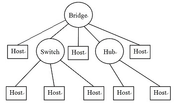

   <table><tr><td bgcolor=black>8,1</td></tr></table>

   <table><tr><td bgcolor=black>交换机的每个端口处于一个冲突域，集线器的所有端口处于一个冲突域。</td></tr></table>

10. 描述以太网的CSMA/CD协议，请填空：

    (1)发送前先`______`，如果信道忙，则`______`，直到信道空闲`______`;

    (2) `______`检测冲突;如果直到发送完毕都没有检测到冲突，则`______`;一旦检测到冲突，立即`______`,在`______`一段时间之后，转(1)。 

    可选词汇：随机延迟 发送成功 立即发送 持续监听 停止发送 边发送  监听信道   

    <table><tr><td bgcolor=black>监听信道，持续监听，立即发送，边发送，发送成功，停止发送，随机延迟</td></tr></table>

11. 如果把以太网协议修改为：在一个站点发送之后另一个站点发送时要求的帧间空隙为w1， 一个站点在自己发完一帧之后再接着发送另一帧时要求的帧间空隙为w2，以下哪些陈述是正确的? 

    A. 如果w1 > w2, 一个有多帧要发送的站点一旦开始发送将连续发送多帧。 

    B. 如果w1 > w2, 如果有其它站点要发送，当前站点发送完毕后即让出信道。 

    C. 如果w1 < w2, 每次所有站点（包括刚发送完的站点）都平等争用信道。 

    D. 如果w1 < w2, 如果有其它站点要发送，当前站点发送完毕后即让出信道。 E. 如果w1 = w2, 每次所有站点（包括刚发送完的站点）都平等争用信道。

    <table><tr><td bgcolor=black>A，D，E</td></tr></table>

12. 对于以太网，以下说法是否正确,标出正确的说法： 

    A.一个站点有可能一直不能发送成功 

    B.优先权高的站点先发送数据帧 

    C.收到数据帧的站点会发送确认帧 

    D.如果很长时间信道空闲，一个站点发送数据帧时一定不会冲突 

    E.规定最短帧是为了使发送站点可以检测到所有冲突 

    F.属于同一个以太网的所有站点都可以收到广播帧

    <table><tr><td bgcolor=black>A，E，F</td></tr></table>

13. 以太网(10BaseT)、快速以太网(100Base-TX)和千兆以太网主要在OSI的哪层或哪个子层不同？  

    A.物理层 

    B.数据链路层 

    C.网络层 

    D.MAC子层 

    E.LLC子层

    <table><tr><td bgcolor=black>A</td></tr></table>

14. 以下哪个操作不是透明网桥算法的操作？ 

    A.filtering 

    B.forwarding 

    C.flooding 

    D.blocking

    <table><tr><td bgcolor=black>D</td></tr></table>

15. 下面的扩展LAN包含三个透明网桥B1、B2、B3和四台主机A、 C、D、E。如果网桥的MAC地址表初始都是空的，在以下三次传输之后MAC地址表的内容是什么？ 

    (1) D发送了一个帧给E; 

    (2) A发送了一个帧给D; 

    (3) C发送了一个帧给A.

    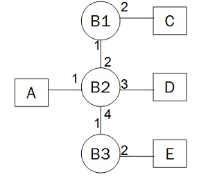

16. 以太网集线器(hub)与交换机(switch)有何不同？  

    A.A switch does not induce any latency into the frame transfer time. 

    B.A switch tracks MAC addresses of directly-connected devices. 

    C.A switch operates at a lower, more efficient layer of the OSI model. 

    D.A switch decreases the number of broadcast domains. E.A switch decreases the number of collision domains

    <table><tr><td bgcolor=black>B</td></tr></table>

    <table><tr><td bgcolor=black>交换机会增加冲突域的数量，减少冲突范围的大小</td></tr></table>

17. 以下哪个设备只属于物理层? 

    A.Switch  

    B.hub 

    C.router 

    D.Bridge

    <table><tr><td bgcolor=black>B</td></tr></table>

18. 如果主机A发送IP分组给主机B, 主机B收到的帧中的源地址是什么?  连接模式: [host A]--[Router R1]--[Router R2]--[host B]，其中包含3个以太网。 

    A.host A''s MAC Address 

    B.host B''s MAC Address 

    C.R1''s MAC Address 

    D.R2''s MAC Address

    <table><tr><td bgcolor=black>D</td></tr></table>

19. 如果透明网桥从接口F0/23收到源地址和目的地址分别为S和D的帧，它将把以下哪个项目记录到MAC地址表? 

    A.D, F0/23 

    B.S, F0/23 

    C.D, S 

    D.S, D

    <table><tr><td bgcolor=black>B</td></tr></table>

20. 下图显示了由五个透明网桥(B1~B5)形成的扩展LAN。

     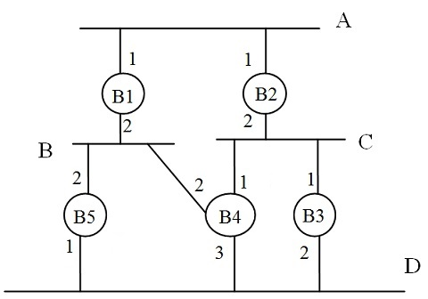

    如果网桥ID使用其下标，所有链路的开销均为1，问： 

    (1) 哪个是根网桥?  

    (2) 网段A~D的指定网桥(designated bridges)分别是什么? 

    A: 

    B: 

    C: 

    D:

    (3) 网桥B1~B5的根端口分别是什么?  

    B1: 

    B2: 

    B3: 

    B4: 

    B5:

    <table><tr><td bgcolor=black>（1）B1 
    （2）B1 B1 B2 B4 
    （3）无 1 1 2 2 
    </td></tr></table>

21. 下图是一个扩展LAN:

    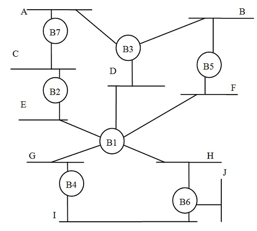

    请回答问题：

    (a)如果B1没有启动生成树算法但是转发生成树消息(BPDU)，生成树的个数是多少？ 它们的根分别是什么？  

    (b)如果B1没有启动生成树算法而且丢弃所有收到的生成树消息(BPDU)，生成树的个数是多少？ 根分别是什么？ 

    <table><tr><td bgcolor=black>(a)1  B2 
    (b)2  B2,B4 
    </td></tr></table>

    <table><tr><td bgcolor=black>(a)B1连接的网段(DEFGH)和B1一起会形成一个网段 
    (b)B2、B3、B5、B7 一棵树 
       B4、B6 一棵树 
    </td></tr></table>

22. 证明透明网桥算法自学习方法的合理性.

    <table><tr><td bgcolor=black>（1）网桥从一个接口收到一个帧，该帧中源地址的主机一定与该接口连通 
    （2）如果整个扩展LAN没有回路，则该接口处于从该网桥到达该主机唯一的路径上。该网桥只有必须把目的地址为该源地址的帧转发到该接口该帧才有可能到达目的地。 
    </td></tr></table>

23. 对于一个连通图，每条边的权重都不为0。任意指定一个节点为根节点,如果每个节点从且仅从一条到根节点的最短路径上选择它的邻接边,证明这些边将形成该图的生成树。

    <table><tr><td bgcolor=black>方法1：N个节点总共有N-1条边，根据到根节点的距离用归纳法证明连通性：按到根的距离把节点排序，一个节点的最短路径上的下一个节点与根连通，则该节点也会与根连通。具有N-1条边和N个节点的连通图是生成树。 
    方法2：假设N-1个节点通过这种方法加入N-1边都不形成回路，则再加入一个节点和一条与之相连的边也不会形成回路,因为由此形成的回路肯定要经过这个节点，这个节点至少要增加两条边，这与前面的操作矛盾。具有N-1条边的没有回路的N个节点的图就是生成树。不过还要证明：如果它们不连通，则会形成n棵树 (n>1)，则这些树的边数（Ni-1，Ni为第i棵树的节点数）之和为N-n，小于N-1，因此，它们必须连通。 
    </td></tr></table>

24. 为什么二进制指数退避算法选择最短帧的发送时间作为其时间槽(time slot)τ的长度?

    <table><tr><td bgcolor=black>因为最短帧的发送时间保证了首先发送的站点的信号可以到达最远的站点。如果先发送的只有一个站点，其他站点要不就检测到发送站点的信号而不能发送，要不就因为发送站点发送完毕而检测到信道空闲，总之不会与之冲突。也就是说，任何间隔τ或以上时间的两个发送数据的站点不会发生冲突。</td></tr></table>

25. 如果所有交换机都是连通的，并且交换机连至交换机的接口都配置为trunk接口，交换机连至主机的接口都配置为VLAN接口（主机接口），则所有连至相同的VLAN接口的主机都位于同一个广播域，连至不同VLAN接口的主机位于不同的广播域。这句话是否正确？ 

    A.正确 

    B.错误

    <table><tr><td bgcolor=black>A</td></tr></table>

26. 下图中哪些发送的帧将被目的主机收到？

    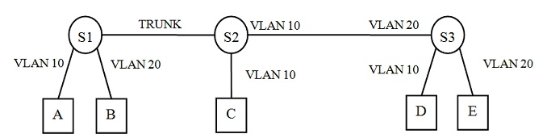

    E发送给A. 

    E发送给B. 

    A发送给E. 

    A发送给D.  

    B发送给D. 

    D发送给A. 

    D发送给B.

    <table><tr><td bgcolor=black>E发送给A,A发送给E</td></tr></table>

## IP协议和IP地址

1. 电话系统采用的服务模型与哪种ATM服务模型类似? 

   A.恒定位速率 

   B.可变位速率

   C.可用位速率 

   D.未指定位速率

   <table><tr><td bgcolor=black>A</td></tr></table>

2. 以下哪种交换技术采用包交换技术且在传送数据之前需要建立连接？ 

   A.电路交换 

   B.数据报 

   C.永久虚电路 

   D.交换式虚电路

   <table><tr><td bgcolor=black>D</td></tr></table>

3. 下图存在3条虚电路（red,green,blue） ,它们都是从A或者B出发的虚电路，请填写它们的虚电路表(虚电路填写次序: red,green,blue)。 * 接口编号用黑色字表示. VCI - Virtual Circuits Identifier

   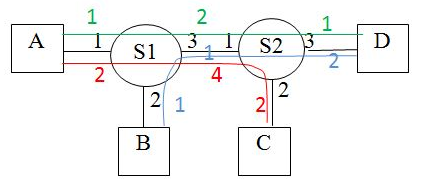

   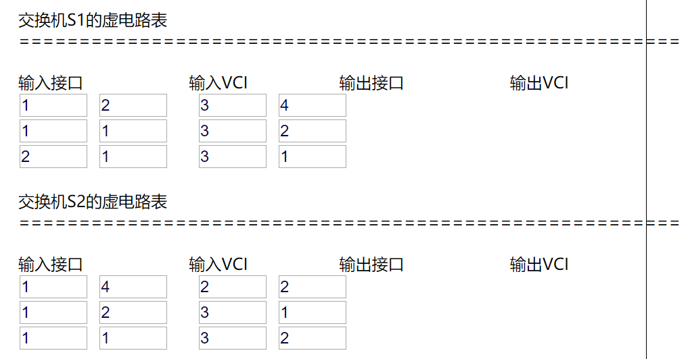

   

4. IP协议可以提供哪种服务? 

   A.constant bit rate service 

   B.connection-oriented service 

   C.reliable transmission service 

   D.guaranteed rate service 

   E.best effort service

   <table><tr><td bgcolor=black>E</td></tr></table>

5. 下面哪些关于IP协议的说法是正确的？ （多选）

   A.IP协议是因特网的网络层协议. 

   B.IP协议可以提供可靠服务. 

   C.IP协议可以提供一种数据报服务. 

   D.IP协议是可路由的(routable). 

   E.IP协议可以用于连接任何物理网络. 

   F.IP协议具有拥塞控制机制.

   <table><tr><td bgcolor=black>A,C,D,E</td></tr></table>

6. 现在使用IP数据报的服务类型字段提供不同的服务被重新定义为`______`.

   <table><tr><td bgcolor=black>区分服务</td></tr></table>

7. 下面哪些关于IP数据报的TTL字段的说法是正确的？ （多选）

   A.每经过一个路由器TTL减1. 

   B.TTL的最大值为128. 

   C.TTL是数据报经过的跳数. 

   D.TTL限制了因特网的直径. 

   E.TTL记录数据报在网上存在的时间. 

   F.TTL防止数据报长时间滞留在因特网上.

   <table><tr><td bgcolor=black>ADF</td></tr></table>

8. IP数据报头部选项最长可以是多少字节？

   <table><tr><td bgcolor=black>40</td></tr></table>

9. 如果一个IP数据报的协议字段的值为17, 目的主机应该把该数据报交给哪个上层协议? 

   A.TCP 

   B.UDP 

   C.ICMP 

   D.IGMP

   <table><tr><td bgcolor=black>B</td></tr></table>

10. 如果不带选项的IP数据报被分段, 这些片段头部的哪些字段可能与原数据报头部字段的内容不一样? （多选）

    A.header checksum

    B.MF 

    C.offset

    D.TTL 

    E.total length 

    F.Identification 

    G.destination address 

    H.protocol

    <table><tr><td bgcolor=black>ABCE</td></tr></table>

11. 一个没有选项的IP数据报的总长度为3000字节，标识(iden)是10034，DF=0，OFFSET=0，要转发到MTU为800的一个物理网络上。如果前面的片段尽量大，如何划分片段？填写这些片段的 iden、offset、MF: 

    ​                 iden      offset        MF

    片段1：`______` `______` `______`, 

    片段2：`______` `______` `______`, 

    片段3：`______` `______` `______`, 

    片段4：`______` `______` `______`

    <table><tr><td bgcolor=black>10034 0   1 
    10034 97  1 
    10034 194 1 
    10034 291 0 
    </td></tr></table>

12. 如果上题的第二个片段在后面的一个路由器上要转发到MTU=300的物理网络上，要继续划分片段，填写这些片段的 iden、offset、MF:

    ​                 iden      offset        MF

    片段1：`______` `______` `______`, 

    片段2：`______` `______` `______`, 

    片段3：`______` `______` `______`

    <table><tr><td bgcolor=black>10034  97  1 
    10034  132 1 
    10034  167 1 
    </td></tr></table>

13. IP的记录路由选项中如果指针为16，表示记录了多少个IP地址？

    <table><tr><td bgcolor=black>3</td></tr></table>

    <table><tr><td bgcolor=black>指针为4时0个，为8时1个,为12时2个,为16时3个</td></tr></table>

14. 下面哪些关于两个IP地址的说法是正确的? （多选）

    A.如果它们在不同的网络，则它们的网络号必须不同. 

    B.如果它们在不同的网络，则它们的主机号必须不同. 

    C.如果它们在相同的网络，则它们的主机号必须相同. 

    D.如果它们在相同的网络，则它们的网络号必须相同. 

    E.如果它们在相同的网络，则它们的主机号必须不同.

    <table><tr><td bgcolor=black>ADE</td></tr></table>

15. 下面的IP地址中A类、B类、C类地址分别有几个? 

    92.168.1.100 

    129.32.123.54 

    223.89.201.145 

    220.18.255.254 

    124.254.200.254 

    191.64.220.8 

    66.254.1.100 

    192.1.100.1 

    202.15.200.12

    <table><tr><td bgcolor=black>3 2 4</td></tr></table>

16. 关于IP分组和IP地址的填空: 

    A.把IP多播地址224.0.1.5转换为MAC多播地址是什么？ 

    B.IP地址192.168.1.255是做什么的？ 

    C.点分十进制IP地址以127开头的是什么地址？ 

    D.如果数据部分为IP分组，以太网的类型字段的值是什么？ 

    E.有类地址191.168.1.2的网络号和主机号分别是什么？

    F.一个C类网可用的IP地址有多少个？

    <table><tr><td bgcolor=black>A. 01-00-5E-00-01-05 
    B. 对远程子网的广播 
    C. 环回地址 
    D. 0x0800 
    E. 191.168  1.2 
    F. 254 
    </td></tr></table>

17. 一个C类网192.1.2.0划分为6个子网，它们分别需要配置2、2、2、2、50、50个接口的IP地址。如果要求消耗最少的IP地址,请采用点分十进制(dotted decimal)格式(a.b.c.d)写出它们的子网号和子网掩码（地址从小到大）：

    <table><tr><td bgcolor=black>192.1.2.0  255.255.255.252 
    192.1.2.4  255.255.255.252 
    192.1.2.8  255.255.255.252 
    192.1.2.12 255.255.255.252 
    192.1.2.64 255.255.255.192 
    192.1.2.128 255.255.255.192 
    </td></tr></table> 

18. 如果用8个C类网193.10.24.0~193.10.31.0形成一个超网(supernet),该超网的子网号和子网掩码是什么?. 

    *子网号和子网掩码都用点分四进制表示a.b.c.d

    <table><tr><td bgcolor=black>193.10.24.0 255.255.248.0</td></tr></table>

19. 下面哪些地址为私有地址?  （多选）

    A.10.200.10.1 

    B.192.1.1.5 

    C.172.15.1.10 

    D.172.32.1.1 

    E.192.168.254.1 

    F.192.169.1.1 

    G.172.31.200.254 

    H.192.168.255.254

    <table><tr><td bgcolor=black>AEGH</td></tr></table>

20. 采用NAT技术，如果从外网发回的IP分组中应该转换的IP地址和端口号是哪个？ 

    A.源IP地址和源端口号 

    B.目的IP地址和目的端口号 

    C.源IP地址和目的端口号 

    D.目的IP地址和源端口号

    <table><tr><td bgcolor=black>B</td></tr></table>

21. ARP请求包的字段哪些是已知的? （多选）

    A.source IP address 

    B.source MAC address 

    C.source port number 

    D.dest IP address 

    E.dest MAC address

    F.dest port number

    <table><tr><td bgcolor=black>ABD</td></tr></table>

22. 关于ARP协议,下面哪些说法是正确的? （多选）

    A.一台主机可以通过ARP协议通过远端IP地址(非直连网)取得其对应的MAC地址。 

    B.在收到ARP请求后源主机的IP地址和MAC地址的映射会缓存在目的主机中。

    C.一个ARP请求可以同时包括多个IP地址。 

    D.ARP请求会超时重传。 

    E.任何物理网络都要使用ARP协议获得MAC地址。 

    F.缓存的IP地址和MAC地址的映射具有生存期。

    <table><tr><td bgcolor=black>BF</td></tr></table>

23. 在一个以太网中，哪个DHCP数据包可以让该网络中的每个DHCP服务器知道DHCP客户端是否选用了它提供的IP地址? 

    A.DHCP discover 

    B.DHCP offer 

    C.DHCP request 

    D.DHCP ack

    <table><tr><td bgcolor=black>C</td></tr></table>

24. 转发IP分组时，在下面哪些情况下，路由器会发送ICMP数据报通知源主机? （多选）

    A.IP数据报的TTL在路由器上减到0. 

    B.对IP数据报进行了分段. 

    C.用目的地址没有查到匹配的路由项. 

    D.目的地址只匹配了默认路由. 

    E.头部检验出错. 

    F.IP分组头部有选项.

    <table><tr><td bgcolor=black>ACE</td></tr></table>

25. 填写上题中发送的ICMP数据报的类型和代码：

    <table><tr><td bgcolor=black>（A）11 0 
    （C) 3  1 
    （E）12 0 
    </td></tr></table>

26. 填空： 

    （1）RIP协议属于 `______`

    （2）OSPF协议属于  `______`

    （3）BGP协议属于 `______`

    （4）路由表中手工配置的路由项称为 `______`

    （5）采用路由协议自动得到的路由称为 `______`

    （6）直连网的路由和默认路由都属于 `______`

    （7）路由协议所用的算法称为`______`算法。 

    可选项：路由，动态路由，静态路由，IGP协议，EGP协议

    <table><tr><td bgcolor=black>IGP协议，IGP协议，EGP协议，静态路由，动态路由，静态路由，路由</td></tr></table>

27. 下面关于查询路由表和转发IP分组的说法哪些是正确的? （多选）

    A.路由表中每一行的下一跳和接口处于同一物理网络中。 

    B.最长匹配原则意味着范围更大的网络首先被选中。 

    C.IP分组总是被转发到下一跳。

    D.下一跳总是有IP地址。 

    E.一个IP分组在转发之前总是要封装成帧。 

    F.如果IP分组的目的地址就在路由器的直连的以太网，则需要用ARP通过该目的地址获得其对应的MAC地址。 

    G.路由器会把目的地址为广播地址的IP分组从所有接口广播出去。

    <table><tr><td bgcolor=black>AEF</td></tr></table>

28. 当路由器为一个IP分组查询路由表，对于以下几种情况，路由器会怎么做？从可选项中选择最合适的（填字母） 

    (1)没有任何匹配项  `______`

    <table><tr><td bgcolor=black>F</td></tr></table>

    (2)有匹配项，下一跳接口为以太网 `______`

    <table><tr><td bgcolor=black>B</td></tr></table>

    (3)有匹配项，下一跳接口为PPP `______`

    <table><tr><td bgcolor=black>C</td></tr></table>

    (4)有匹配项，没有下一跳，匹配项的接口为以太网 `______`

    <table><tr><td bgcolor=black>A</td></tr></table>

    (5)有匹配项，没有下一跳，匹配项的接口为PPP `______`

    <table><tr><td bgcolor=black>C</td></tr></table>

    可选项： 

    A.用IP分组的目的地址查询MAC地址   (ARP协议) 

    B.用下一跳的地址查询MAC地址       (ARP协议) 

    C.直接把IP分组封装成帧发送出去 

    D.用IP分组的源地址查询MAC地址     (ARP协议) 

    E.直接把IP分组发送出去 

    F.丢弃该分组

29. 下图为路由器R60的路由表：

    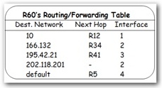

    如果R60依次收到目的地址为10.1.1.20、166.132.5.5、202.118.201.227、195.42.22.1的IP分组，R60转发它们的下一跳分别是什么？

    <table><tr><td bgcolor=black>R12 
    R34 
    - 
    R5 
    </td></tr></table>

30. 下图为路由器R1的路由表：

    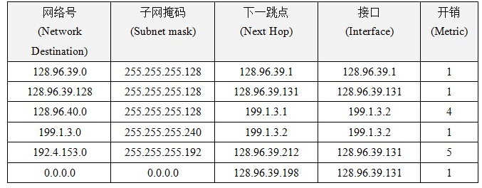

    如果R1依次收到目的地址为192.4.153.17、128.96.39.10、128.96.40.12、128.96.40.151和192.4.153.90的IP分组，R1转发它们的下一跳分别是什么？ 

    <table><tr><td bgcolor=black>128.96.39.212 
    128.96.39.1 
    199.1.3.1 
    128.96.39.198 
    128.96.39.198 
    </td></tr></table>

31. 主机和路由器通过三个以太网连接：[H1]-N1-[R1]-N2-[R2]-N3-[H2]。主机和路由器的每个接口的IP地址都配置正确。如果除了一种配置其他配置都是正确的，问其中哪种配置错误或者没有配置会导致一下问题？ 

    (1)H1可以ping通R1左边接口的IP地址但是ping不通R1右边接口的IP地址?

    (2)H1可以ping通R1右边接口的IP地址但是ping不通R2左边接口的IP地址? 

    (3)H1可以ping通R2左边接口的IP地址但是ping不通R2右边接口的IP地址? 

    (4)H1可以ping通R2右边接口的IP地址但是ping不通H2的IP地址?

    可选项：

    A.R1配置N3的静态路由指向R2 

    B.R2配置N1的静态路由指向R1 

    C.H1配置默认路由指向R1 

    D.H2配置默认路由指向R2 

    <table><tr><td bgcolor=black>CBAD</td></tr></table>

32. 对于上题的三种情况，ping会分别返回什么错误？(填字母)

    可选项： 

    A.timeout 

    B.destination host unreachable

    <table><tr><td bgcolor=black>BABA</td></tr></table>

33. 下面的路由表为一台主机的路由表，该主机有一个有线网卡(BroadCom)和一个无线网卡(Intel)，接口编号分别为0x10003和0x10004。无线接口为活动接口，其IP地址、子网掩码和默认网关分别为192.168.2.101、255.255.255.0、192.168.2.1。

    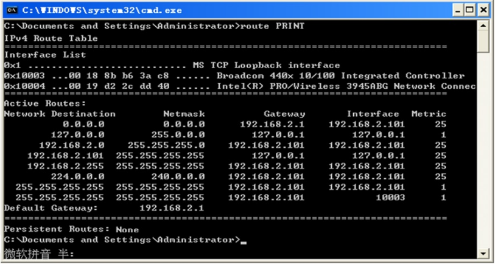

     --下一跳(Gateway)：直连网(接口IP地址)或环回网络（127.0.0.1，即自己）。 

    --接口(interface): 发往某个接口(接口IP地址)或环回接口(127.0.0.1) 

    --最长匹配原则:多项匹配且子网掩码一样长时，选择metric最小的，如果metric也一样，则同时转发到这些网络。 

    当要发送的IP数据报的目的地址分别匹配路由表的第1~8项时，其含义为：

    可选项： 

    在无线网络中进行多播 

    发给无线网络中的主机 

    在有线网络中进行广播 

    在无线网络中进行(远程)广播 

    在无线网络中进行广播 

    发给默认网关 

    发给环回网络（自己）

    <table><tr><td bgcolor=black>发给默认网关 
    发给环回网络（自己） 
    发给无线网络中的主机 
    发给环回网络（自己） 
    在无线网络中进行广播 
    在无线网络中进行多播 
    在无线网络中进行广播 
    在有线网络中进行广播 
    </td></tr></table>

34. 用什么办法可以确定一个IP地址在一个以太网中没有(正在)被用?

    <table><tr><td bgcolor=black>发送一个ARP请求，如果有收到ARP响应，表示这个ip已经被对应的MAC使用，否则就是没有被使用</td></tr></table>

35. ping可以在子网中产生一个广播帧，请给出并解释方法。

    <table><tr><td bgcolor=black>ping本网一个不存在的IP地址，因为ARP映射表中肯定没有，所以会发送ARP请求。ARP请求就是广播帧。或者直接ping对本网的广播，例如：ping 192.168.1.255。这个ICMP消息会用广播帧封装。</td></tr></table>

36. 一台路由器连接两个子网（以太网）: N1-[R1]-N2。如果一台主机从一个子网移到另一个子网，并修改为另一个子网的IP地址，如何增加路由器的功能使这台主机还可以接收到用原IP地址发给它的数据报？

    <table><tr><td bgcolor=black>利用ARP协议，当其它主机在N1查询该主机的原IP地址的MAC地址时，R1要用自己的MAC地址进行响应。其它主机就会把IP数据报用帧发给R1，R1再转给该主机(位于N2中)。具体可查ARP代理</td></tr></table>

37. 用一个交换机连接主机H1和H2。H1如何可以窃听到本网络中任何发给H2的帧?

    <table><tr><td bgcolor=black>对任何用H2的IP地址查询H2的MAC地址的ARP请求，H1都要尽快用自己的MAC地址发出ARP响应。H1也可以用H2的IP地址和自己的MAC地址进行主动查询。</td></tr></table>

38. 如果一个路由器连接了两个以太网，如何采用DHCP协议让这两个以太网可以共用一个DHCP服务器？

    <table><tr><td bgcolor=black>这里假设DHCP服务器只能接入其中一个子网，并具有两个子网的地址池可分配，路由器作为DHCP中继代理：
    当另一个子网的DHCP客户机广播请求地址租赁时，中继代理服务器就会把这个消息转发给另一子网中的DHCP 服务器，然后再将DHCP服务器返回的分配IP地址的消息转发给DHCP客户机，从而协助DHCP客户机完成地址租赁。</td></tr></table>

39. 当一台主机要向远方的另一台主机发送很多数据报。如果它希望这些数据报中途不要分段以节约路由器的时间，这就要找到路径上最小的MTU，有何方法？假设这段时间该路径不会改变。

    <table><tr><td bgcolor=black>Ping远端主机，每个数据报的DF均设置为1（即不允许分段），ICMP有效载荷的字节数从大到小变化，直到得到响应。也可以直接发送数据报而不用ping。</td></tr></table>

40. 一台主机往远方的另一台主机发送数据报。如何可以通过数据报的TTL字段和ICMP协议依次（由近至远）得到整条路径上的路由器的IP地址（每个路由器只需要得到一个IP地址）? 假设这段时间该路径不会改变。

    <table><tr><td bgcolor=black>不断ping另一台主机，并且TTL从1开始不断增加。查traceroute命令。</td></tr></table>

## Routing Protocols: RIP,OSPF

1. 什么是自治系统(Autonomous System)? 
    A.a kind of automobile system
    B.a kind of organization
    C.a kind of web server
    D.a kind of computer system
    E.a kind of network

   <table><tr><td bgcolor=black>E</td></tr></table>

2. 以下哪个协议是外部网关协议(Exterior Gateway Protocol)?
    A.RIP
    B.OSPF
    C.BGP
    D.EIGRP

   <table><tr><td bgcolor=black>C</td></tr></table>

3. RIP协议采用了什么路由算法? 

   <table><tr><td bgcolor=black>距离向量路由算法</td></tr></table>

4. 简述RIP协议的工作原理。 

   <table><tr><td bgcolor=black>路由器每30秒把自己的路由表发送给邻居。路由器用邻居发来的路由表根据最短路径算法修改自己的路由表。初始时每个路由器只有到直连网距离为1的路由。</td></tr></table>

5. 路由器A~G运行RIP协议，每跳的距离为1。B和C是邻居。如果B和C此时的路由表如下所示:

   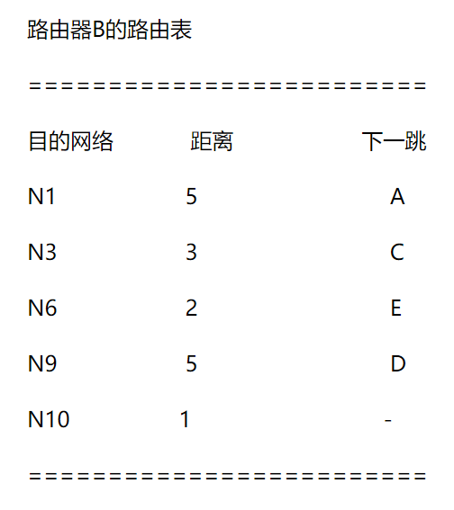

   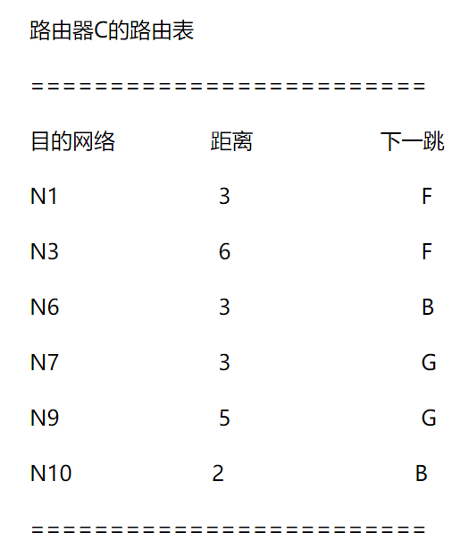

   当路由器B接收到来自C的路由表之后对路由表进行自己的更新， 请写出更新之后B的路由表(注意：网络下标从小到大):

   <table><tr><td bgcolor=black>
       N1   4   C 
   N3   7   C 
   N6   2   E 
   N7   4   C 
   N9   5   D 
   N10  1   - 
   </td></tr></table>

6. 如果路由器B离路由器A的距离是10跳: Router A--10 hops--Router B。当一个网络接入路由器A，路由器B要建立该网络的路由最长需要多少秒？

   <table><tr><td bgcolor=black>300或330</td></tr></table>

7. 两个RIP路由器连接了三个网络: N1--R1--N2--R2--N3。在R1因N1失效而把N1的路由的距离改为16（无穷大）之后，下面哪个事件会触发计数到无穷现象？
    A. R1 sends its routing table to R2.
    B. R2 sends its routing table to R1.
    C. N2 fails.
    D. N3 fails.

   <table><tr><td bgcolor=black>B</td></tr></table>

8. 水平分割(Horizon-split)算法可以防止任何计数到无穷的现象，true or false? 
    A.true
    B.false

   <table><tr><td bgcolor=black>B</td></tr></table>

9. OSPF协议采用了什么路由算法? 

   <table><tr><td bgcolor=black>链路状态路由算法</td></tr></table>

10. 简述OSPF协议的工作原理。 

    <table><tr><td bgcolor=black>(1)周期性地收集链路状态，并扩散出去 
    (2)用收到的链路状态建立整个 AS 的拓扑结构图 
    (3)利用 Dijkstra 算法计算到 AS 中所有网络的最短路径 
    (4)利用这些路径上的下一跳建立路由表。 
    </td></tr></table>

11. 下图中的路由器R1、R2和R3运行OSPF协议

    

    问：
     有多少个router LSA?
     有多少个network LSA? 

    <table><tr><td bgcolor=black>3  1</td></tr></table>

    <table><tr><td bgcolor=black>环回网络只是末端网。只有一个中转的多路访问网络，所以netwrok LSA的个数为1.</td></tr></table>

12. 一个OSPF路由器通常使用什么算法来求到所有目的地的最短路径? 

    <table><tr><td bgcolor=black>Dijkstra算法</td></tr></table>

13. 如果一个OSPF路由器的链路没有变化，它每隔多长时间会扩散它的LSA？ 
     A.60分钟
     B.30分钟
     C.30秒
     D.60秒

    <table><tr><td bgcolor=black>B</td></tr></table>

14. 一个OSPF路由器如何知道它的一个直连网是中转网？

    <table><tr><td bgcolor=black>这个网为多路访问网络且在这个网络中有OSPF邻居（建立了完全相邻关系）</td></tr></table>

15. 下图的OSPF网络中，R1~R5的router LSA是什么？

    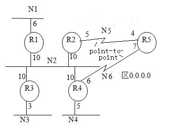

     链路类型取值：   

    1   Point-to-point network

    2   Link to transit network

    3   Link to stub network

    <table><tr><td bgcolor=black>From R1 
    ======================= 
    to   metric   link type 
    N1     6         3 
    N2     10        2 
    From R2 
    ======================= 
    to   metric   link type 
    R5    5         1 
    N5    5         3 
    N2    10        2 
    From R3 
    ======================= 
    to   metric   link type 
    N2    10        2 
    N3     3        3 
    From R4 
    ======================= 
    to   metric   link type 
    R5     6         1 
    N6     6         3 
    N2     10        2 
    N4     5         3 
    From R5 
    ======================= 
    to   metric   link type 
    R2     4         1 
    N5     4         3 
    R4     7         1 
    N6     7         3 
    </td></tr></table>

16. 在上题图中，N2的Network LSA是什么？

    <table><tr><td bgcolor=black>from N2 
    ================== 
    to  metric 
    R1  0 
    R2  0 
    R3  0 
    R4  0 
    </td></tr></table>

17. 在15题的OSPF网络中，R5的路由表是什么?

    <table><tr><td bgcolor=black>目的 开销 下一跳 
    N1  20   R2 
    N2  14   R2 
    N3  17   R2 
    N4  12   R4 
    N5  4     - 
    N6  7     - 
    </td></tr></table>

18. （RIP协议）无论回路有多长，只要所有路由器都启动了抑制算法，就不会出现计数到无穷的问题，请证明一下。

    <table><tr><td bgcolor=black>在最远点的路由器R的这个距离无穷大的路由可能被其它邻居路由器发来的路由（距离<16）所修改，因为邻居路由器不是路由器R的这个路由的下一跳。</td></tr></table>

19. 在路由有变化时，立即将有变化的路由发送给邻居，这就是RIP的触发更新机制。试着解释一下为什么有了触发更新还要保留原有的每30秒把路由表发送给邻居的机制。

    <table><tr><td bgcolor=black>触发更新可能丢失；路由表也可能出错；要用TTL清除无效路由。可以考虑一个特例：当一个网络由于一条线路出故障变为了两个网络，这时用触发更新很难清除无效路由。</td></tr></table>

## Transport Layer

1. 因特网传输层的主要协议为`______`和 `______`

   <table><tr><td bgcolor=black>UDP，TCP</td></tr></table>

2. 如果有效载荷为TCP，IP数据报的协议字段的值是什么?

   <table><tr><td bgcolor=black>6</td></tr></table>

3. 以下哪些关于UDP协议的陈述是对的： （多选）

   A.它提供了面向连接(connect-oriented)的服务. 

   B.传送的数据段会丢失. 

   C.具有保序性. 

   D.负责在进程之间传送数据. 

   E.接收进程收到的数据段数与接收缓冲区大小有关.

   <table><tr><td bgcolor=black>BD</td></tr></table>

4. 下面哪个部分被加入到UDP数据段的校验和中? （多选）

   A.UDP header(checksum filled with 0) 

   B.UDP data 

   C.Source IP address 

   D.Dest IP address 

   E.TTL(1B)and protocol(1B) 

   F.Header CheckSum(2B)in IP Header 

   G.0(1B)and protocol(1B) in IP Header 

   H.Length(2B)in IP datatgram 

   I.UDP Length(2B) 

   J.Iden in IP datatgram(2B) 

   K.flags(3b) and offset(13b) in IP datatgram

   <table><tr><td bgcolor=black>A,B,C,D,G,I</td></tr></table>

5. 端口号1000是哪种类型的端口？ 

   A.well-known ports

   B.registered ports 

   C.private ports

   <table><tr><td bgcolor=black>A</td></tr></table>

6. TCP的紧急数据(urgent data)是带外数据，不属于字节流，true or false? 

   A.true 

   B.false

   <table><tr><td bgcolor=black>A</td></tr></table>

7. 数据段中哪个标志可以令TCP协议把缓存数据立即发给接收进程? 

   A.ack 

   B.rst 

   C.psh 

   D.fin

   <table><tr><td bgcolor=black>C</td></tr></table>

8. 如果TCP连接出现错误，TCP协议将发送标志`______`为1的数据段，并立即结束连接.

   <table><tr><td bgcolor=black>RST</td></tr></table>

9. 以下哪个TCP会话是非对称的(asymmetric)? 

   A.Establish connection 

   B.Transfer Data 

   C.Close Connection

   <table><tr><td bgcolor=black>A</td></tr></table>

10. 对TCP连接而言，下面哪些叙述是正确的? （多选）

    A.TCP连接的一方接收的数据段数等于另一方发送的数据段数. 

    B.一个进程可以与其它进程建立两个以上的TCP连接. 

    C.一个TCP连接可以在三个或更多进程之间建立 

    D.一个TCP连接的一方发送的数据段会按序到达另一方 

    E.一个TCP连接提供无比特错的数据传送

    <table><tr><td bgcolor=black>BE</td></tr></table>

11. TCP协议的数据传送服务采用哪种工作方式? 

    A.simplex 

    B.half duplex 

    C.full duplex

    <table><tr><td bgcolor=black>C</td></tr></table>

12. 建立TCP连接的三次握手使用的标志分别是什么? 

    <table><tr><td bgcolor=black>SYN,SYN+ACK,ACK
    </td></tr></table>

13. 下面哪些陈述对TCP连接的初始序号(initial sequence number,ISN)是对的? （多选）

    A.一般采用随机数. 

    B.第一个数据段的序号为ISN+1. 

    C.两个方向的ISN必须不同. 

    D.SYN标志表示数据段包含ISN. 

    E.ISN取值一般与系统时间无关.

    <table><tr><td bgcolor=black>ABD</td></tr></table>

14. 下面哪四个元素决定了连接的唯一性?  （多选）

    A.source port(TCP) 

    B.destination port(TCP) 

    C.protocol(IP) 

    D.ttl(IP) 

    E.source address(IP) 

    F.destination address(IP)

    <table><tr><td bgcolor=black>ABEF</td></tr></table>

15. 主动发起关闭TCP连接的一方在关闭连接之前等待2MSL的原因是什么? 

    A.恢复连接. 

    B.防止两个连接发生冲突. 

    C.等待接收TCP管道中的数据. 

    D.等待该连接的数据在因特网中消失.

    <table><tr><td bgcolor=black>D</td></tr></table>

16. 长度分别为360字节、600字节、600字节和512字节的四个数据段通过一个TCP连接连续传送. 如果第一个数据段的序号为8000,其它数据段的序号是多少？

    <table><tr><td bgcolor=black>8360  8960  9560</td></tr></table>

17. 下图为一个普通TCP连接的数据传送图（不使用Nagle Algorithm,Delayed ACK,Fast Retransmission,Slow start等）, 请填空.

    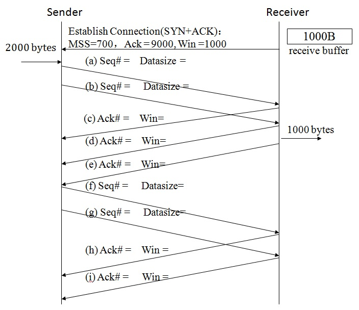

    <table><tr><td bgcolor=black>(a)9000，700 
    (b)9700，300 
    (c)9700，300 
    (d)10000，0 
    (e)10000，1000 
    (f)10000，700 
    (g)10700，300 
    (h)10700，300 
    (i)11000，0 
    </td></tr></table>

18. 假设一个TCP连接的接收缓冲区大小为4600字节，如果该连接的一个AdvWin为`______`的确认到达后，紧接着AdvWin为`______`的另一个确认丢失了，该连接会发生死锁现象。

    <table><tr><td bgcolor=black>0  4600</td></tr></table>

19. 如何解决上题的死锁问题?

    <table><tr><td bgcolor=black>当发送方有数据要发送时定期发送一个字节给接收方直到收到窗口不为0的确认。</td></tr></table>

20. 在建立TCP连接, 发送方收到接收方的参数“MSS=500, Sequ#=10000, Win=1000”之后, 发送方每10毫秒发送两个字节. 如果使用Nagle算法并且RTT等于 42ms, 问该发送方发送前三个数据段的有效载荷分别有多少字节?

    <table><tr><td bgcolor=black>2 8 8</td></tr></table>

21. 一个TCP连接的接收缓冲区大小为2000, 接收方提出的MSS为500。如果使用了Clark算法，在发送了AdvWin=0的确认之后，接收方空闲块的大小为多少字节时才发送下一个确认? 

    <table><tr><td bgcolor=black>至少为500</td></tr></table>

    <table><tr><td bgcolor=black>空闲块的大小到达接收缓冲区的一半或MSS</td></tr></table>

22. 对于快速重传(fast retransmission), 收到多少个对某个数据段序号的确认(表示期待接收该数据段)将触发数据的重传? 

    <table><tr><td bgcolor=black>4</td></tr></table>

    <table><tr><td bgcolor=black>重复收到3个，总共收到4个</td></tr></table>

23. 只要发送或存在未确认的数据帧，就要启动超时定时器，true or false? 

    A.true 

    B.false

    <table><tr><td bgcolor=black>A</td></tr></table>

24. 如果只有最后三个连续发送的数据段被丢失，其它数据段全部收到且RTT一直保持20ms, 从这三个数据段的第一个数据段发送开始计时，还需要多少时间(ms)才可以全部收到这三个数据段的确认? 

    <table><tr><td bgcolor=black>200</td></tr></table>

    <table><tr><td bgcolor=black>20+20 + 40+20 + 80+20  
    = 40+60+100 
    = 200 
    </td></tr></table>

    <table><tr><td bgcolor=black>karn算法：每次超时重传，timeoutInterval加倍；后续发送的数据段都采用当前的timeoutInterval，重传的数据段的ACK不用来计算timeoutInterval。</td></tr></table>

25. 采用Jacobson算法计算TCP会话的超时时间,如果EstimatedRTT=10ms, DevRTT=1ms, SampledRTT=20ms, 问：新的DevRTT、EstimatedRTT和TimeoutInteval分别为多少毫秒? 

    <table><tr><td bgcolor=black>3.25 11.25 24.25</td></tr></table>

    <table><tr><td bgcolor=black>SampleRTT- EstimatedRTT = 10ms 
    EstimatedRTT(new) = 10ms + 1/8 * 10ms = 11.25ms 
    DevRTTRTT(new) = 3/4*1ms + 1/4 * 10ms = 3.25ms 
    TimeoutInterval = EstimatedRTT + 4*DevRTT = 11.25+4*3.25=24.25ms 
    </td></tr></table>

26. 如果一个TCP数据段的传送在超时时间(30ms)内未收到确认, 重传数据段的超时时间应该设为多少毫秒? 

    <table><tr><td bgcolor=black>60</td></tr></table>

27. 如果window scale = 4 并且 advertisedWindow = 65534, SWS(Send Window Size)=? 

    *不考虑CongWin.

    <table><tr><td bgcolor=black>1048544</td></tr></table>

    <table><tr><td bgcolor=black>AdvWin =65534*2^4   SWS=min{AdvWin,CongWin}=AdvWin</td></tr></table>

28. TCP长肥管道中的同序号数据段应该采用什么选项区分它们? 

    A.WinScale 

    B.Selective Acknowledgement 

    C.MSS 

    D.timestamp

    <table><tr><td bgcolor=black>D</td></tr></table>

29. 下面哪些陈述是正确的? （多选）

    A.Flow control prevents too many data from being sent into network. 

    B.Congestion control prevents too many data from being sent into network. 

    C.Flow control prevents too many data from being sent to receiver. 

    D.Congestion control prevents too many data from being sent to receiver.

    <table><tr><td bgcolor=black>BC</td></tr></table>

30. 如果AdvWin等于20000，CongWin等于1000, SWS(Sending Window Size)等于多少?

    <table><tr><td bgcolor=black>1000</td></tr></table>

31. 如果AIMD(Additive Increase Multiplicative Decrease)用于TCP连接的拥塞控制, 当发生拥塞时, CongWin=10MSS, 它的新的CongWin是多少? 

    在4个RTT之后, 它的CongWin又是多少? 

    <table><tr><td bgcolor=black>5MSS  9MSS</td></tr></table>

32. 假设Tahoe算法被用于TCP连接的拥塞控制, 当超时发生时, CongWin等于16MSS, 如果期间没有发生超时，在5个RTT之后CongWin是多少? 

    <table><tr><td bgcolor=black>10MSS</td></tr></table>

    <table><tr><td bgcolor=black>Explanation: 
    2mss，4Mss，8mss，9mss，10Mss 
    </td></tr></table>

33. 假设Reno算法(快速恢复算法)被用于TCP连接的拥塞控制, 当收到三个重复的ACK时, CongWin等于16MSS, 如果期间没有发生超时，在5个RTT之后CongWin是多少? 

    <table><tr><td bgcolor=black>13MSS</td></tr></table>

    <table><tr><td bgcolor=black>Explanation: 
    9MSS,10MSS,11MSS,12MSS,13MSS 
    </td></tr></table>

34. 发送FIN数据段的一方说明它不再发送任何数据了，true or false？ 

    A.true 

    B.false

    <table><tr><td bgcolor=black>A</td></tr></table>

35. 请说明使用一次握手建立TCP连接会出现什么问题.

    <table><tr><td bgcolor=black>只有一次握手的话，也就是说客户端只要发送了连接请求就认为TCP连接，也许服务器根本就不存在或者没打开。如果继续发送数据的话，浪费带宽。再说客户端也需要服务器传来的初始序号和很多选项，这个都做不到。</td></tr></table>

36. 请说明使用二次握手建立TCP连接会出现什么问题. (考虑恶意攻击的情况)

    <table><tr><td bgcolor=black>只有两次握手的话，服务器可能会因为遭遇恶意攻击而瘫痪：客户端可以发送大量伪造源地址的连接请求，服务器确认后以为连接已经建立，最后会耗尽资源。（网上查询DoS攻击）</td></tr></table>

37. 请说明使用三次握手建立TCP连接不能避免恶意攻击的情况.

    <table><tr><td bgcolor=black>对于每一个连接请求，服务器都得至少进行一次响应，所以攻击者可以伪造大量请求让服务器不断响应最后瘫痪</td></tr></table>

38. 在下图中，R1和R2为路由器，S1为二层交换机，S2为三层交换机并配置了VLAN10和VLAN20的虚接口。R1到R2为一个配置了IP地址并使用PPP协议的点到点网络，其它四个(VLAN10，VLAN20，R1~R10，R2~H5)子网都是以太网。如果所有主机、三层交换机和路由器都正确配置了接口的IP地址，三层交换机和路由器都启动了OSPF协议，R1的默认路由指向R10并被发布到OSPF协议，

    问：H1 ping H3、H1 ping H4、H1 ping H5时依次经过了哪些设备（主机和路由器）以及它们分别使用了以下哪种协议？ 

    *只用写单程，只考虑把IP分组从源主机传送至目的主机。 

    *只写数字，中间不要加逗号或空格，例如：H1:9653 S1:132 S2:13 H3:8。（只是答案的格式例子，不针对任何问题） 

    *ARP协议包含了获得MAC地址的整个过程，即不用写它使用的以太网协议和透明网桥算法。    

    *对于传送数据帧的双方，只需要在发送方写(2)和(3)。

    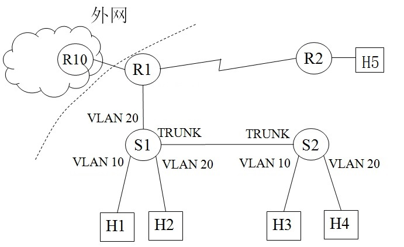

    可选项： 

    (1)透明网桥算法（带VLAN） 

    (2)802.1Q协议（trunk） 

    (3)以太网协议 

    (4)ARP协议（IP地址为下一跳） 

    (5)ARP协议（IP地址为IP分组的目的地址）

    (6)查询路由表 

    (7)PPP协议 

    (8)从收到的帧中取出IP分组 

    (9)网络层从上层收到数据并封装为IP分组

    H1 ping H3： `______`

    H1 ping H4： `______`

    H1 ping H5：`______`

    <table><tr><td bgcolor=black>转发数据包或ARP协议时，只要发送出去，都要封装成帧。如果转出去的接口是以太网，则要封装成802.3的帧，并用CSMA/CD从物理层发送出去。答案省略了所有以太网协议(3)。 
    H1 ping H3 => H1:965  S1:12   S2:21  H3:8 
    H1 ping H4 => H1:964  S1:12   S2:2865 H4:8 
    H1 ping H5 => H1:964  S1:12   S2:28642 S1:21 R1:867 R2:7865 H5:8 
    </td></tr></table>

39. 接上题，增加两个可选项，H1 ping 外网IP地址时依次使用了以下哪种协议？（只用写单程，只用考虑到R10转发出去，不必考虑后续转发步骤）

    (10)匹配了默认路由 

    (11)NAT 

    H1 ping 外网地址：`______`

    <table><tr><td bgcolor=black>10用A表示  11用B表示。省略了所有以太网CSMA/CD （3） 
    H1:964  S1:12   S2:286A42 S1:21 R1:86AB4 R10:86A...   
     </td></tr></table>